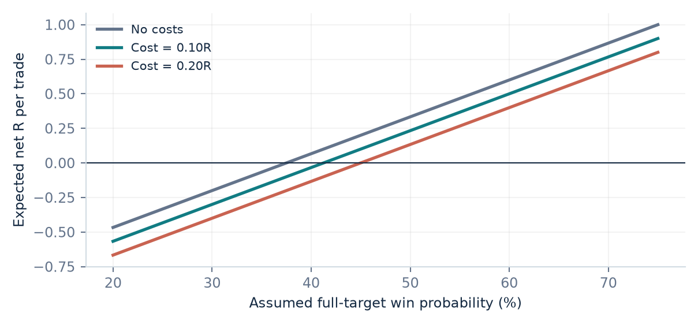
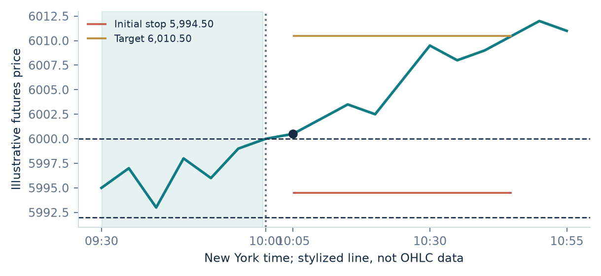
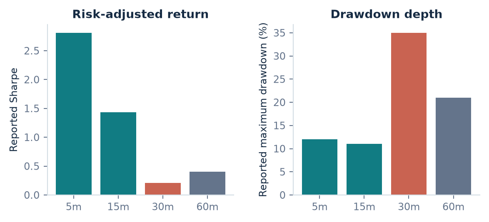
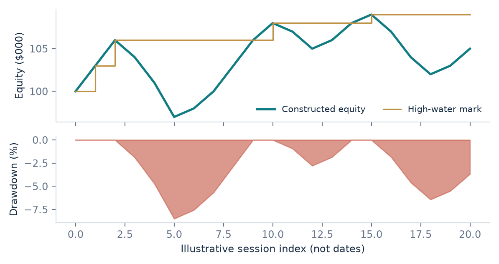
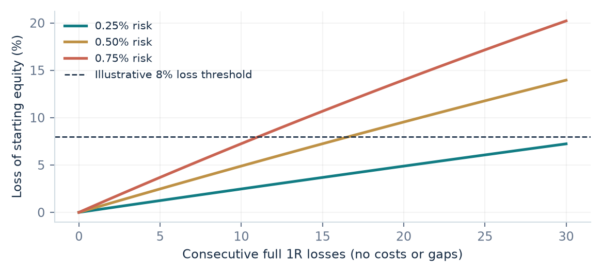
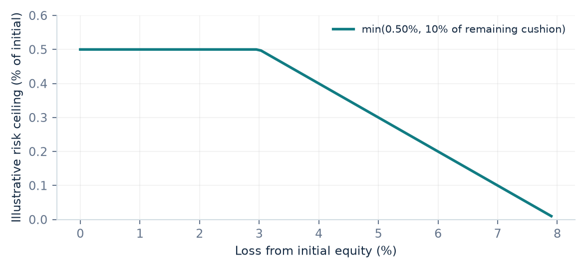
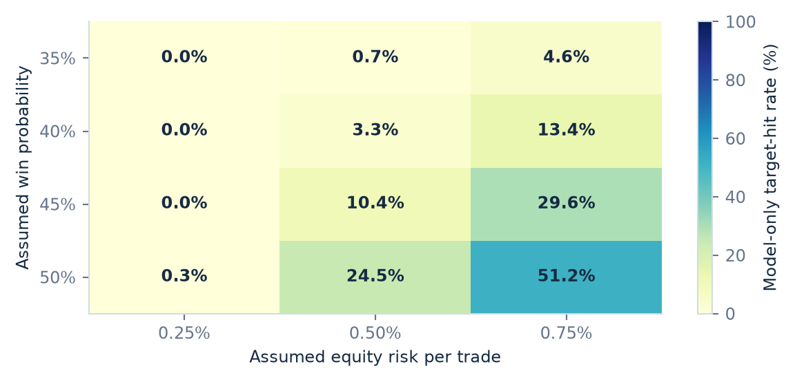
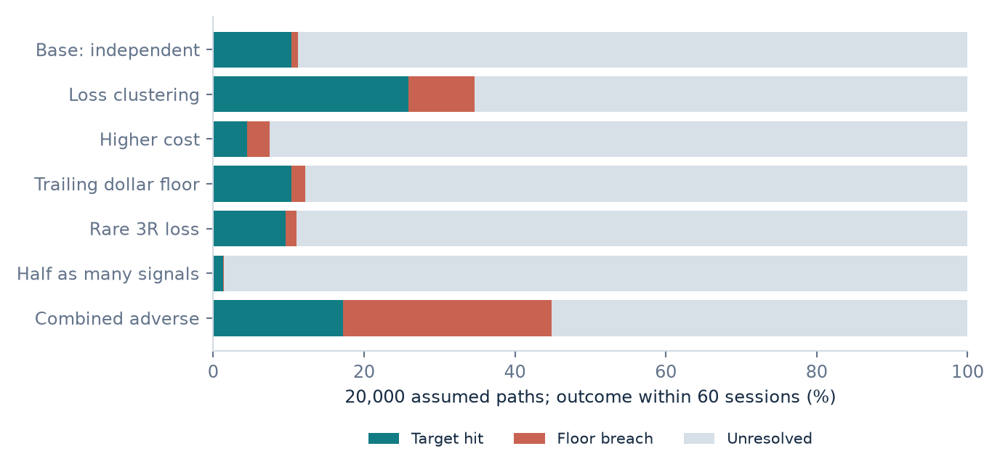

<!-- PAGE cover | STRATEGY 01 / RESEARCH DOSSIER | Opening Range Breakout -->
# OPENING RANGE
# BREAKOUT
## The forensic research dossier

**Strategy 1 · Prop Intraday Volatility Breakout**

What it means. How it trades. Why an edge might exist. Where it fails.

A critical examination of SSRN research, execution mechanics, drawdown periods, performance statistics and the evidence required before implementation.

**ES / MES research focus · 30-minute opening range · 5-minute decision bars**

Prepared 8 September 2026 · Version 1.0

> RESEARCH, NOT A PERFORMANCE PROMISE | This document does not establish a profitable live strategy. Earlier synthetic results are corrected inside. Published backtests, design proposals and hypothetical calculations are kept separate throughout.

**PDF first. Pine Script later.**

<!-- PAGE brief | READER'S BRIEF | The conclusion before the detail -->
# The conclusion before the detail

An Opening Range Breakout, or ORB, is a rule for joining a move beyond the high or low established near the start of a trading session. It buys strength or sells weakness in the hope that an early imbalance continues. A useful ORB is not simply two horizontal lines: it is the combination of a market, session, selection filter, executable entry, exit policy, position size and cost structure.

The research supports investigating some members of this strategy family. It does **not** validate our exact 30-minute ES/MES prototype. The distinction matters because two superficially similar ORBs can hold different instruments, enter at different times and have radically different payoff distributions. The strongest direct study reviewed here relies on selecting unusually active individual stocks, not on trading an index future every morning. [1](https://papers.ssrn.com/sol3/papers.cfm?abstract_id=4729284)

## Three conclusions to carry through the report

- **Selection and timing are part of the edge.** In one study, the 5-minute Stocks-in-Play portfolio reported a Sharpe ratio of 2.81, while its 30-minute counterpart reported 0.21 and a 35% maximum drawdown. Neither number is a forecast for ES. [1](https://papers.ssrn.com/sol3/papers.cfm?abstract_id=4729284)
- **A good annual result can still fail an evaluation.** Path-dependent loss limits, floating losses, fees and trailing floors can terminate a strategy before its eventual recovery. A low closing-equity drawdown is not proof of intraday compliance.
- **The local prototype is not deployment-ready.** This review found future-information entry logic, ambiguous intrabar fills, fractional futures sizing and statistical-labeling problems. The previous high win rate and 100% simulated pass rate are withdrawn as live expectations.

## How to read the evidence labels

**REPORTED** means a number stated in a cited paper, not independently replicated here. **DERIVED** means arithmetic from disclosed inputs. **ILLUSTRATIVE** means an invented scenario. **PROPOSED** means a rule to test. **UNKNOWN** means we lack adequate evidence. Unknown is not zero.

> DECISION | Use this dossier to specify and test an ORB, not to buy an evaluation account or increase leverage. The immediate deliverable is research; no Pine Script or live broker integration has been built in this step.

<!-- PAGE contents | READER'S MAP | Find the question you want answered -->
# Find the question you want answered

The PDF bookmarks and the links below take you to each major investigation. References identify the exact paper, its version, the material actually accessed, and the boundary of the claim.

{{TOC}}

## Reading routes

**New to ORB?** Start with the meaning, the causal rulebook and the two worked trades. The word “breakout” describes an entry condition, not a prediction that the next trade wins.

**Concerned about drawdown?** Read the evidence tables, drawdown anatomy, losing-streak calculations and challenge-floor chapter together. The percentage loss is only one dimension; duration and distance to liquidation are equally important.

**Preparing to code?** Read the indicator conventions, entry chronology, code audit and future Pine acceptance tests. Translating defective Python literally would only reproduce a misleading backtest in another language.

**Evaluating the research?** Read all three direct/related paper case studies, then the contrary evidence and statistical-inference section. The source register differentiates full retrievable text, selective main-text review and abstract-only evidence.

> SCOPE | This is a targeted critical review, not an exhaustive systematic review of every ORB publication. It includes favorable and unfavorable findings, but no licensed market-data replication. Market prices in worked examples are fictional.

<!-- PAGE corrections | 01 / EVIDENCE RESET | Correcting the earlier claims -->
# Correcting the earlier claims

The earlier answer presented a 54-configuration optimization as “walk-forward,” called the settings optimal for live trading, and treated synthetic metrics as expected performance. Those descriptions were too strong. The local artifacts were audited on 8 September 2026; this report supersedes their interpretation, not their underlying code.

| Earlier statement | What the evidence actually supports |
| --- | --- |
| 72.7% win rate; 2.79 profit factor; +0.51R expectancy | Outputs reported from a short synthetic run with unresolved execution and accounting defects. Not empirical estimates of the strategy. |
| 0.69% maximum daily DD | A sampled, modeled account metric. It excludes important intrabar paths and is not a bound on future losses. |
| 100% challenge pass in about 15 days | Conditional resampling output from the same selected synthetic trades, using a different trade-frequency model. Not a live pass probability. |
| 97.4% “SSRN confidence” | An implementation's DSR-style output with unsupported trial assumptions. SSRN does not certify a strategy or assign compliance grades. |
| 54-parameter walk-forward optimization | One generated 90-session price sample, reused across 54 configurations; no rolling train/test split or untouched holdout. |
| 2.5% kill-switch guarantees compliance | A pre-entry check is not continuous account surveillance or emergency liquidation. Gaps can exceed a stop. |

## Why this changes the conclusion

The most serious issue is chronology. The strategy uses a completed candle's close to approve a trade but books entry near that same candle's earlier opening-range crossing. At that crossing, the future close is not yet known. Parameter optimization cannot repair this information advantage; it can optimize around it.

The trade count also changes when an account reaches its profit target and stops trading. Comparing a short, successful path with a longer path is not a clean comparison of unconditional strategy quality. The Monte Carlo then reuses those selected trades and supplies extra daily trading opportunities that the original one-trade-per-day implementation did not have.

> CURRENT STATUS | Real-market win rate, expectancy, maximum drawdown, recovery duration and challenge pass probability for the proposed ES/MES strategy are **unknown**. The trading journal's previous balances and trades are now clearly labeled legacy demonstrations, not verified records.

<!-- PAGE meaning | 02 / FOUNDATIONS | What the strategy actually means -->
# What the strategy actually means

Imagine observing the first half-hour after the U.S. cash equity market opens. During that interval buyers and sellers establish a local high and low. A breakout trader waits for price to escape that range and attempts to capture continuation. A mean-reversion trader may take the opposite view: the escape is temporary and price will return. The chart alone does not tell us who is right.

The **opening range** is a time-defined measurement, not a claim that markets are stationary inside it. The **breakout** is a later event. Keeping those separate prevents a subtle error: using the completed range to authorize a trade that supposedly happened before the range had finished forming.

## Four related rules that must not be confused

| Family | How it enters | What is different |
| --- | --- | --- |
| Fixed-window ORB | A later breach of the first n-minute high or low | The range is observed first; the breach follows. |
| Opening-direction trade | Long or short at the next bar's open according to the first bar's direction | Does not require a later breach of the first bar's extreme. |
| Open-plus-volatility breakout | Opening price plus/minus a historical volatility threshold | The threshold need not use an observed intraday range. |
| Dynamic intraday-band momentum | Crossing a boundary that changes with time of day | Not a fixed opening range; subsequent signals may occur all day. |

The individual-stock paper tests the first family; the QQQ paper's core implementation tests the second; the older crude-oil study tests the third; the related SPY paper tests the fourth. Their results cannot be pooled as repeated measurements of one system. [1](https://papers.ssrn.com/sol3/papers.cfm?abstract_id=4729284) [2](https://papers.ssrn.com/sol3/papers.cfm?abstract_id=4416622) [3](https://papers.ssrn.com/sol3/papers.cfm?abstract_id=4824172) [12](https://doi.org/10.1016/j.frl.2012.09.001)

## The specific research question here

Can a **30-minute, trend-filtered, fixed-range breakout on ES or MES**, with realistic costs and firm-specific risk constraints, produce positive net expectancy and an acceptable distribution of account paths? That is narrower than “does momentum exist?” It requires a new test. The prop-firm overlay determines survival; it does not create predictive information.

<!-- PAGE mechanism | 02 / FOUNDATIONS | Why it might work — and why it might not -->
# Why it might work — and why it might not

An economically plausible story is necessary, but it is not sufficient evidence of an edge. The ORB hypothesis is that the opening price action reveals an imbalance that other participants cannot or do not remove immediately. The strategy seeks the continuation component, not volatility in isolation.

## Candidate continuation mechanisms

**Information arrives unevenly.** A company announcement or macro surprise can change valuations. Participants differ in attention, models and execution speed. Some institutions spread large trades over time rather than execute all at once. This can make the first price response incomplete. The Stocks-in-Play study uses abnormal opening volume as an observable selection variable consistent with this story. It does not prove that every high-volume move reflects informed trading. [1](https://papers.ssrn.com/sol3/papers.cfm?abstract_id=4729284)

**Hedging can reinforce a move.** A participant with negative gamma who maintains a delta-neutral hedge may need to buy more as price rises and sell more as it falls. This mechanism can amplify movement. The futures intraday-momentum literature links late-day continuation to hedging demand, but the measured horizon is not our morning breakout. [5](https://papers.ssrn.com/sol3/papers.cfm?abstract_id=3760365)

**Execution constraints can delay clearing.** Risk limits, inventory management, transaction costs and slow capital reallocation can prevent immediate arbitrage. A temporary imbalance can therefore be economically plausible even in a liquid market. However, a plausible delay must last long enough to exceed spread, slippage and adverse selection at our own entry.

## Countermechanisms

Liquidity providers may fade the move, initial traders may take profits, or a second announcement may overturn the first interpretation. Positive-gamma hedging can lean against movement instead of reinforcing it. A breakout can also represent the final burst of demand rather than its beginning. An EMA filter reacts to prior prices; it does not reveal hidden orders or causal intent.

> TESTABLE HYPOTHESIS | At the executable entry time, conditional expected net continuation must be positive. “Price broke resistance” is a description. “Smart money must keep buying” is an untested causal claim. Record the observable predictor, its timestamp and a falsifiable outcome before looking at results.

<!-- PAGE math | 02 / FOUNDATIONS | The mathematics: a breakout is not a free edge -->
# A breakout is not a free edge

Let A be the frozen ATR estimate, a the stop multiplier, b the target multiplier, and f the fraction of equity risked before costs. The initial stop distance is aA and the gross target distance is bA. One price-risk unit, R, is the initial entry-to-stop exposure; it is not the account balance and it must not shrink when a trailing stop moves.

:::formula
Gross target in R = b / a
Net expectancy in R = p × W − (1 − p) × L − c
Break-even win probability = (L + c) / (W + L)
:::

Here p is a hypothetical win probability, W and L are average gross winning and losing R magnitudes, and c is average round-trip cost in R. With a = 1.2 and b = 2.0, the full-target win is 1.6667R. If every loss is 1R and there are only two outcomes, break-even is 37.50% before costs and 41.25% at c = 0.10R. Time exits and trailing stops invalidate the two-outcome simplification; use realized average payoffs instead.

*DERIVED · Hypothetical payoff geometry. Lines vary assumed win probability; they are not fitted ORB performance curves.*

## The fair-game benchmark

For a driftless continuous Brownian price starting at entry, with absorbing barriers a points below and b points above, the probability of hitting the upper barrier first is a/(a+b). Its gross expected stopped P&L is zero: that probability times b equals the complementary probability times a. Adding a breakout condition does not automatically create drift after entry. Under appropriate martingale and stopping assumptions, clever exits alone do not manufacture expected profit.

Volatility changes how quickly barriers may be reached, not necessarily which side has a profitable expectation. Jumps, finite session horizons and state-dependent drift require richer models. The useful question is therefore whether our observable conditioning information changes the **net payoff distribution**, not whether an attractive reward-to-risk ratio looks profitable on paper.

<!-- PAGE rulebook | 03 / STRATEGY SPECIFICATION | A causal baseline we can actually test -->
# A causal baseline we can actually test

**PROPOSED: ORB-30R, research version 0.1.** This is a clarified experimental specification, not a claim that the existing Python implements it correctly. The 30-minute window and 1.2/2.0 ATR bracket preserve the strategy we were discussing, but their profitability remains unverified.

| Component | Precise baseline convention |
| --- | --- |
| Instrument | One liquid ES or MES contract; actual contract-month prices and correct point value. No fractional futures. |
| Decision bars | Regular-session 5-minute bars; explicit America/New_York timezone. |
| Range | High and low of [09:30, 10:00), six complete bars. Freeze at 10:00. |
| Indicators | Wilder ATR(14) and EMA(20/50) across consecutive regular-session bars; warm-up at least 250 valid bars. |
| Long / short filter | Last completed close above EMA20 and EMA20 above EMA50 / the symmetric below conditions. |
| Range gate | Opening-range width no greater than 5 × last completed ATR. Heuristic to be tested, not a sourced law. |
| Entry | At each eligible boundary, arm a stop one tick beyond the range in the allowed direction for the next bar only. Do not backdate fills. |
| Stale or crossed entry | If price has already passed the entry when the order could first be sent, skip that order; no retrospective fill at the range. |
| Trading window | Orders active only from 10:00 up to, but not including, 13:30. Cancel pending entries at cutoff. |
| Trade budget | At most one filled trade per session, total across both directions; one open position, no pyramiding. |
| Bracket | Freeze ATR when the order is armed; place a 1.2A stop and 2.0A target relative to actual fill, tick-rounded and risk-rechecked. |
| Trailing overlay | Separately labeled on/off experiment: activation at +1.8A; trail 1.0A behind favorable extreme, never loosen. |
| Session close | Flat by 15:50 ET, or earlier under shortened sessions / broker restrictions. |

The next pages resolve execution details that a headline rule misses. This baseline differs from the legacy code in indicator smoothing, timing, sizing and risk surveillance. It also differs from every cited paper. A later close-confirmed version would be a **separate strategy**, entering only after the confirming close at an available subsequent price.

<!-- PAGE session | 03 / STRATEGY SPECIFICATION | Session clocks, bars and Nairobi time -->
# Session clocks, bars and Nairobi time

Use **New York local time**, not a fixed “EST” offset throughout the year. New York switches between EDT (UTC−4) and EST (UTC−5); Nairobi remains at UTC+3. The session must follow the U.S. market clock. These conversions were checked with Python's timezone database for September and December 2026.

| Event | New York ET | Nairobi during EDT | Nairobi during EST |
| --- | --- | --- | --- |
| Cash-session open | 09:30 | 16:30 | 17:30 |
| 30-minute range complete | 10:00 | 17:00 | 18:00 |
| Entry cutoff | 13:30 | 20:30 | 21:30 |
| Proposed flat deadline | 15:50 | 22:50 | 23:50 |
| Normal cash-session close | 16:00 | 23:00 | 00:00 next day |

For **8 September 2026**, the EDT column applies. Session dates should still be stored in New York time alongside an unambiguous UTC timestamp. A broker's daily-loss reset may use an entirely different timezone; never derive that reset from the trader's laptop clock.

## The bar-label trap

With opening-time labels, the bar stamped 09:55 contains trading from 09:55 up to 10:00. Its high, low and close are not final at 09:55. The first six bars are 09:30, 09:35, 09:40, 09:45, 09:50 and 09:55. Including the bar stamped 10:00 would create a 35-minute range. Similarly, closing a position at the **close** of a bar stamped 15:50 generally means 15:55, not 15:50.

## Session and holiday controls

Require an exchange calendar, reject missing opening bars, and provide an earlier flattening rule on shortened sessions. A generic business-day calendar includes dates when the exchange may be closed or shortened. ES trades outside cash hours, but this ORB deliberately anchors to the U.S. cash session; that is a design choice, not the full futures trading schedule.

TradingView's chart-display timezone does not determine a Pine script's session logic. Use an explicit timezone in calculations rather than assuming the chart setting controls the strategy. [15](https://www.tradingview.com/pine-script-docs/concepts/time/)

<!-- PAGE indicators | 03 / STRATEGY SPECIFICATION | Indicator definitions and information timing -->
# Indicator definitions and information timing

A multiplier means little until the underlying estimator, units and sample are specified. In particular, **14 daily ATR observations are not the same thing as 14 five-minute bars**. The direct stock studies use daily volatility estimates; our proposed bracket uses five-minute volatility.

:::formula
TR(t) = max[H(t) − L(t), |H(t) − C(t−1)|, |L(t) − C(t−1)|]
ATR(t) = [13 × ATR(t−1) + TR(t)] / 14
EMA(n,t) = α × C(t) + (1 − α) × EMA(n,t−1), α = 2/(n+1)
:::

The displayed ATR recursion is Wilder smoothing, seeded with the mean of the first 14 valid true ranges. For reproducibility, maintain a documented warm-up before any trades, and carry estimates across regular sessions rather than reinitializing them every morning. With regular-session-only bars, the first true range of the day compares with the previous regular-session close and can include the overnight gap. An extended-session estimator is a different experiment.

## Why the legacy estimate differs

The current Python uses a simple rolling mean of true range and backfills early missing values. Backfilling makes later information available to earlier rows. This is a warm-up defect, although the larger same-bar entry problem is more consequential. The clarified baseline uses no future fill and deliberately chooses Wilder smoothing; the two results must not be treated as interchangeable.

## Freeze what determines the trade

For a stop order armed at a completed-bar boundary, save its ATR and bracket distances. If it is still unfilled at the next boundary, cancel and re-evaluate it before issuing any replacement. If it fills, retain that saved ATR for initial R, target and the experimental trailing activation. Otherwise a change in ATR can move the goalposts after entry.

**Relative opening volume**, if later tested, is today's completed opening-window volume divided by the mean volume in the **same window** over prior sessions. Do not use today's eventual full-day volume or rank by information that was unavailable at order time. ES volume also changes around contract rolls; a stock-selection result is not automatically a futures-volume filter. [1](https://papers.ssrn.com/sol3/papers.cfm?abstract_id=4729284)

<!-- PAGE chronology | 03 / STRATEGY SPECIFICATION | Entries: what is knowable, and when? -->
# Entries: what is knowable, and when?

The difference between a profitable-looking simulation and a tradable strategy can be one misplaced timestamp. A research engine must process information in the sequence in which a trader could have observed it.

## Stop-entry chronology

1. **At 10:00:** the six opening bars are complete. Compute the range and read indicators using information no later than this boundary.
2. **Before an order exists:** verify the trend filter, remaining risk allowance, available quantity and whether the stop is still ahead of the market. Save the reference price and decision timestamp.
3. **After acknowledgment:** an actual later touch or trade-through can trigger the stop. A buy stop becomes an executable buy order; its trigger price is not a guaranteed fill price.
4. **At fill:** record actual price and time, activate the protective bracket and reconcile quantity. A rejection or partial fill is a risk event, not a hypothetical full position.
5. **At the next completed-bar boundary:** expire an unfilled order, or manage the filled position under already declared rules. Do not use a new close to change whether an earlier fill occurred.

## Close-confirmed alternative

A long rule may instead require a completed close above the opening high and above the trend filter. That is legitimate **only if entry occurs after that close**, ordinarily at the next available price. It trades later and may miss part of the move. It cannot approve with the final close and receive the earlier crossing price. This is precisely the inconsistency identified in the local prototype.

## The OHLC ambiguity problem

Suppose a bar's high crosses the target and its low crosses the stop. OHLC data alone do not reveal their order. A target-first engine systematically favors the trader on ambiguous bars. Use finer data with known sequencing, or report a conservative adverse-first result plus an explicitly optimistic sensitivity bound. A stop-entry candle also needs immediate protection; ignoring exits until the next bar grants an artificial grace period.

> IMPLEMENTATION RULE | No favorable extreme before the entry time may activate a trailing stop. No new trailing level may protect an earlier portion of the same bar. Lower-timeframe replay improves sequencing; it still does not recreate bid/ask queues or guarantee live fills. [14](https://www.tradingview.com/pine-script-docs/concepts/strategies/)

<!-- PAGE exits | 03 / STRATEGY SPECIFICATION | Stops, targets and the trailing-stop trade-off -->
# Stops, targets and the trailing-stop trade-off

The initial bracket defines a risk plan, not a maximum possible loss. A stop-market order prioritizes execution once triggered but can fill beyond its trigger. A stop-limit order constrains the price but can remain unfilled during a fast move. Neither promises both price and execution.

## The proposed bracket in R units

| Feature | ATR distance | Initial price-risk equivalent |
| --- | --- | --- |
| Initial stop | 1.2A adverse | −1.00R before costs |
| Full target | 2.0A favorable | +1.6667R before costs |
| Trailing activation | 1.8A favorable | +1.50R excursion |
| First trail at exact activation | 0.8A profit-side stop level | +0.6667R before costs and gaps |

The activation is only 0.2A below the full target. This leaves a narrow region in which the trailing overlay can matter before target execution. If the target is hit first, the trail does nothing. If the price reverses after activation, it may preserve a partial gain; if the trail is too sensitive, it may also turn a later full winner into a smaller exit. A higher win rate does not necessarily improve expectancy.

:::formula
Long stop after activation: S(next) = max[S(current), highest post-entry price − A]
Short stop after activation: S(next) = min[S(current), lowest post-entry price + A]
:::

For a bar-close implementation, calculate the ratchet from known post-entry extremes at the completed boundary and apply it prospectively. Keep the stop monotonic. A continuously managed broker trail is a different timing model and requires its own execution test.

## What must be measured

Compare the same eligible signals with and without the overlay. Record average winning R, average losing R, stop-out frequency, maximum favorable excursion, profit given back, average holding time and costs. Count trail modifications and rejected updates. Do not conclude that trailing is beneficial simply because it rescued one reversal example.

The studies reviewed here often allow much larger winners or use an end-of-day exit. Their favorable results cannot be used to justify a tight 1.67R ceiling without testing how much of the positive payoff tail that ceiling removes. [1](https://papers.ssrn.com/sol3/papers.cfm?abstract_id=4729284) [2](https://papers.ssrn.com/sol3/papers.cfm?abstract_id=4416622)

<!-- PAGE sizing | 03 / STRATEGY SPECIFICATION | Position sizing that respects real contracts -->
# Position sizing that respects real contracts

ES and MES are discrete exchange-traded contracts. An ES contract is $50 per index point; MES is $5 per point. Both use quarter-point increments, so their tick values are $12.50 and $1.25 respectively. Ten MES contracts have the same point exposure as one ES, but fee schedules and execution can differ. [13](https://www.cmegroup.com/education/courses/micro-e-mini-futures/micro-e-mini-futures-products-overview)

:::formula
Q = floor{ B / [d × V + C(rt) + S(reserve)] }
B = minimum of equity-risk budget, remaining daily allowance,
remaining total-loss allowance and other applicable risk caps
:::

Q is contracts; d is the tick-rounded stop distance in points; V is dollars per point; C(rt) is estimated round-trip fees **per contract**; S(reserve) is a per-contract execution allowance. Deduct an additional account-level safety reserve before using an external loss boundary. The risk budget is not the broker's margin requirement.

## Worked sizing example — invented inputs

Assume $100,000 research equity, a $500 maximum trade budget, ATR = 5.0 points and a 1.2ATR stop = 6.0 points. Suppose ES round-trip fees are $5 and the slippage reserve is two ticks in total. For MES suppose $2 fees and the same two-tick reserve. These fees are examples, not broker quotations.

| Instrument | Risk + fees + reserve per contract | Contracts under $500 | Planned budget used |
| --- | --- | --- | --- |
| ES | $300 + $5 + $25 = $330 | 1 | $330 |
| MES | $30 + $2 + $2.50 = $34.50 | 14 | $483 |

This uses floor rounding, not nearest rounding. Forcing one contract when the budget cannot afford it breaches the plan. If even one MES is too large, the correct result is **no trade**. The local code's 0.2-contract minimum and hundredth-contract quantities are not valid ES/MES execution.

Risk is rounded and recomputed after price levels are placed on the tick grid. If a gap changes actual entry distance materially, quantity and protective orders must be reconciled. A small displayed margin does not make a large position safe; the economically relevant resource is the loss allowance remaining before failure.

<!-- PAGE long | 04 / WORKED TRADES | An orderly long breakout, step by step -->
# An orderly long breakout, step by step

**ILLUSTRATIVE — not a historical trade or recommendation.** Assume a completed opening high of 6,000.00 and low of 5,992.00. ATR is 5.00 points, so the 8-point range passes the proposed 25-point maximum-range gate. The last completed close and EMA20/50 satisfy the long filter; that filter's numerical values are assumed, not inferred from the schematic.

At a later eligible boundary, price is still below 6,000.25 and a buy stop is acknowledged at that level. It triggers and fills at 6,000.50, a one-tick adverse entry difference. From the **actual fill**, the initial stop is 5,994.50 and the target is 6,010.50. The bracket distances are 6 and 10 points. One ES contract has $300 initial price risk.

*ILLUSTRATIVE · Stylized path showing levels, not measured five-minute OHLC. Range extremes are assumptions; the line is a teaching diagram. Protective fill sequencing still requires finer data.*

## Two possible outcomes from the same entry

**Target outcome.** If the target executes at 6,010.50, gross P&L is 10 × $50 = $500 for one ES. With the example $5 total fees, net P&L is $495, or +1.65R relative to $300 price risk. The entry slippage is already reflected in the actual fill and must not be subtracted again. Any measured exit slippage would reduce this further.

**Trail outcome.** A post-entry favorable extreme of 6,009.50 reaches the 1.8ATR activation. A prospective 1ATR trail is 6,004.50. If it later executes there without extra slippage, gross profit is 4 × $50 = $200; net after $5 is $195, or +0.65R. On coarse bars, first establish whether the original stop or target executed before granting this ratchet.

The lesson is not that the long trade should win. It is that every decision has a timestamp, every payoff has a denominator, and each cost must be included exactly once.

<!-- PAGE failed | 04 / WORKED TRADES | A failed breakout and the symmetric short -->
# A failed breakout and the symmetric short

**ILLUSTRATIVE.** Keep the long entry at 6,000.50, stop at 5,994.50 and initial price risk of $300 for one ES. The next move fades back into the range. If the stop-market order fills at 5,994.00 rather than its trigger, the loss is 6.5 × $50 = $325. Add $5 round-trip fees: net P&L is **−$330, or −1.10R**. A planned 1R loss is not a contractual cap.

## How a normal loss becomes an operational loss

| Situation | Required response | What not to do |
| --- | --- | --- |
| Normal stop, correctly sized | Record the loss and end the one-trade session | Re-enter immediately to “recover” it |
| Stop rejected after entry | Use the documented emergency protection/flattening path | Assume the chart line is a broker order |
| Partial entry, full-size exit order | Reconcile net quantity and correct protective orders | Leave an exit that could reverse the account |
| Feed goes stale during the trade | Check broker-held protection and independent monitoring | Keep trusting a frozen local P&L display |
| Gap through the risk boundary | Flatten when executable; preserve audit trail | Pretend the stop price was achieved |

## Short-side mirror

Suppose the completed range low is 5,992.00, the short trend filter passes, and a valid later sell stop at 5,991.75 fills at 5,991.50. With the same ATR, the initial stop is 5,997.50 and the target is 5,981.50. For a short, adverse execution means selling lower or buying back higher than the reference price.

The trailing activation level is 5,982.50, 9 points below entry. At exactly that favorable extreme the proposed short trail becomes 5,987.50, one ATR above the low, locking a theoretical 4-point gain before costs. The short stop can move down, not back up. The actual sequence of target, trail activation and stop events must still be known.

## A process success can be a losing trade

A properly sized, accurately logged loss is compatible with a successful execution process. A profitable trade entered using unavailable information is not. Review signal quality and operational compliance separately from the sign of P&L. Otherwise the journal rewards lucky deviations and punishes valid losses—the opposite of what a systematic process needs.

<!-- PAGE evidence | 05 / SSRN FORENSICS | The evidence map and its limits -->
# The evidence map and its limits

SSRN is a research distribution platform. A paper's presence there is not a profitability warranty, independent replication, peer-review certificate or prop-firm endorsement. Several referenced works also have journal publication records; the source register distinguishes those from working-paper series and author-hosted versions.

| Evidence | What it can inform | What it cannot establish here |
| --- | --- | --- |
| Stocks-in-Play ORB [1] | Opening-volume selection and different range lengths | An ES/MES 30-minute EMA/ATR edge |
| QQQ/TQQQ opening-direction study [2] | Payoff asymmetry, leverage constraints, cost sensitivity | A true stop-entry ORB with a 1.67R target |
| SPY dynamic-band momentum [3] | Intraday continuation, exit design, exposure scaling | Our fixed range, trailing ratchet or firm compliance |
| Gao et al.; Baltussen et al. [4,5] | Late-day momentum and candidate mechanisms | Automatic morning breakout profitability |
| Time Series Momentum [6] | A broader persistence research context | Transferring monthly evidence to five-minute trading |
| DSR, PBO, PSR, Sharpe statistics [7–10] | How to evaluate an alleged edge | Repairing leaked data or creating missing evidence |
| Day-trader cohort study [11] | A counterweight to easy-income claims | This ORB's exact probability of failure |
| Older crude-oil ORB [12] | Regime instability and threshold definitions | A current ES strategy with modern execution costs |

## The forensic questions applied to each study

What exactly was traded? When was each input known? Were fees, spreads, slippage and financing included? Was the universe point-in-time? How many variations were tried? Is there an untouched later sample? Does the reported drawdown use closing marks or intraday equity? Is the return series available for independent reconciliation?

The next chapters answer these questions where the accessed text permits, and leave them unresolved where it does not. The direct ORB PDFs were read in full retrievable text. The long SPY PDF was retrieved only through the first 30 PDF pages; its main methods and cited tables were available. Some supporting studies were accessed at abstract level only.

> EVIDENCE BOUNDARY | A favorable story and an attractive paper table motivate replication. They are not substitutes for it. Related papers from overlapping author teams and datasets should not be counted as independent confirmations of our strategy.

<!-- PAGE stocks-method | 05 / SSRN FORENSICS | Case study A: Stocks in Play — the design -->
# Case study A: Stocks in Play — the design

**Zarattini, Barbon & Aziz · SSRN 4729284.** The paper studies roughly 7,000 U.S. stocks over 1 January 2016 to 31 December 2023, combining a CRSP universe with IQFeed intraday data. The authors state that delisted stocks are included. That is a material improvement over testing only today's surviving or popular symbols. [1](https://papers.ssrn.com/sol3/papers.cfm?abstract_id=4729284)

## Reconstructing the trading rule

The base universe requires an opening price above $5, previous 14-day average daily volume of at least one million shares, and a prior 14-day ATR above $0.50. After the first five minutes, the opening candle determines direction: a bullish candle permits a buy stop at its high; a bearish candle permits a sell stop at its low. A doji produces no order.

An executed position receives a stop **10% of daily ATR** away from entry. It otherwise exits at the end of the regular session. There is no tight 2ATR profit ceiling like the proposed local bracket. The authors describe risking 1% of the capital allocated to each position, with a 4× leverage constraint. The modeled starting account is $25,000 and commission is $0.0035 per share. These are study assumptions, not current universal broker terms. [1](https://papers.ssrn.com/sol3/papers.cfm?abstract_id=4729284)

## The economically important modification

For each stock, opening relative volume compares the completed first five minutes with the same interval in the previous 14 sessions. The selected portfolio requires relative volume of at least 1× and considers the top 20 stocks ranked on that measurement. Crucially, this is an **ex-ante selection rule**, not a retrospective list of the eventual best-performing stocks.

The paper reports average net trade P&L of −0.02R below 1× relative volume, +0.08R above 1× and +0.38R above 30×. These thresholds are nested and very high thresholds yield fewer opportunities; they are not independent tests. [1](https://papers.ssrn.com/sol3/papers.cfm?abstract_id=4729284)

## Why this is not our strategy

This is a cross-sectional, catalyst-sensitive stock portfolio with daily ATR sizing and open-ended intraday winners. We have discussed one index future, a 30-minute range, EMA20/50 and a capped reward. Copying the paper's Sharpe ratio onto that different system would discard precisely the features that may explain the result.

<!-- PAGE stocks-results | 05 / SSRN FORENSICS | Case study A: the results that matter -->
# Case study A: the results that matter

**REPORTED, not independently replicated.** The following selected facts are transcribed from Tables 1–3 of the accessed paper. “IRR” and “Sharpe” retain the paper's labels; they are not recomputed from a daily return file. [1](https://papers.ssrn.com/sol3/papers.cfm?abstract_id=4729284)

| Variant | Total return | IRR | Sharpe | Maximum DD |
| --- | --- | --- | --- | --- |
| Base 5-minute ORB | 29% | 3.2% | 0.48 | 13% |
| 5-minute + relative volume | 1,637% | 41.6% | 2.81 | 12% |
| 15-minute + relative volume | 272% | 17.4% | 1.43 | 11% |
| 30-minute + relative volume | 21% | 2.3% | 0.21 | 35% |
| 60-minute + relative volume | 39% | 4.1% | 0.40 | 21% |
| Equal-weight timeframe combination | 234% | 15.8% | 1.99 | 7% |

*REPORTED DATA, ORIGINAL CHART · Four selected portfolios in source [1], Table 3. All use Stocks-in-Play selection. This is not a sensitivity test on ES.*

The 5-minute selected portfolio's reported annual volatility is 14.8%, compared with 6.6% for the base portfolio. Its worst daily return is −1.61%, worse than the base portfolio's −0.8%, despite a slightly better full-sample maximum drawdown. Selection raised returns, but concentration also changed the daily loss distribution. [1](https://papers.ssrn.com/sol3/papers.cfm?abstract_id=4729284)

The 48.4% “Hit Ratio” is kept under the table's own label. It should not be presented as a universal per-trade win rate; the stock-level win ratios elsewhere in the paper use a different aggregation. The central lesson is variation across definitions and aggregation levels—not “ORB wins about half the time.”

<!-- PAGE stocks-critique | 05 / SSRN FORENSICS | Case study A: what survives a skeptical reading? -->
# What survives a skeptical reading?

The favorable result is meaningful enough to investigate, but several questions stand between a published curve and an implementable strategy. This critique is not an allegation of misconduct. It identifies information required for independent replication.

## Strengths worth retaining

The study specifies a dated universe, includes delisted names according to the authors, uses observable opening activity instead of hindsight stock selection, includes explicit commissions and compares multiple range lengths. The weak base strategy is reported alongside the strong selected one. The 30-minute result is particularly useful counterevidence against treating every opening window as equivalent. [1](https://papers.ssrn.com/sol3/papers.cfm?abstract_id=4729284)

## Unresolved execution and portfolio details

**Capital allocation.** “1% of the capital allocated to the position” is not the same as 1% of the entire account for every stock. Replication must specify allocations, unused cash, simultaneous orders, total leverage, partial fills and the sequencing of opportunities. Twenty nominal 1% account risks could be dangerously different from twenty allocations sharing a budget.

**Corporate actions.** The authors describe unadjusted intraday prices. That avoids some retrospective threshold distortions but does not eliminate split handling. Prior daily ATR, volume filters and symbol mappings still require point-in-time corporate-action treatment.

**Net of commission is not net of everything.** A stop-entry on an unusually active stock can face adverse selection, spreads, gaps, halts and short-locate constraints. Commission assumptions are explicit; a complete order-level liquidity and borrow audit was not established in this review.

**Search and concentration.** The winning window, top-20 count, volume threshold, universe screens and stop width are research choices. Record all tested alternatives and verify the selection rule on later untouched data. A table of the best stocks after the experiment must never become an ex-ante whitelist for the same period.

## The safe inference

The evidence is consistent with the importance of **unusual participation plus early timing** in that tested stock universe. It does not prove why the relationship exists, how much capacity it has, or that it persists after realistic execution on a different venue. Most importantly, it gives no basis for describing our 30-minute ES configuration as the “SSRN-validated optimum.”

<!-- PAGE qqq-method | 05 / SSRN FORENSICS | Case study B: QQQ is not the same entry -->
# Case study B: QQQ is not the same entry

**Zarattini & Aziz · SSRN 4416622 · accessed revision 22 September 2025.** The core test spans 1 January 2016 through 17 February 2023. It uses QQQ and TQQQ, with aggregated data attributed to Interactive Brokers. The revised manuscript is important: an upload or revision date is not an extension of the sample into 2025. [2](https://papers.ssrn.com/sol3/papers.cfm?abstract_id=4416622)

## Exact core implementation

The strategy enters at the **open of the second five-minute candle** in the direction of the first candle. A positive first candle means long; a negative one means short; a doji is skipped. This is an opening-direction strategy. It does not wait for a later breakout of the first candle's high or low.

The stop is the first candle's opposite extreme. The target is 10R, with end-of-day liquidation if neither stop nor target is reached. The initial account is $25,000; the risk budget is 1% of capital, subject to a 4× leverage cap. The modeled commission is $0.0005 per share, and **no slippage is assumed**. [2](https://papers.ssrn.com/sol3/papers.cfm?abstract_id=4416622)

:::formula
Shares = floor{ min[ 0.01 × account / stop-distance,
                     4 × account / entry-price ] }
:::

The leverage cap means that a narrow stop does not always permit the full desired risk allocation. The paper explores TQQQ as a leveraged product that changes effective underlying exposure. That does not create a new forecast or remove risk; it changes exposure to the same underlying movement and introduces product-specific behavior.

## A radically different payoff profile

The prose reports 1,795 QQQ trades, a 24% trade win rate and average P&L of +0.13R. The low win rate is compensated by asymmetric winners, not by an unusually high prediction accuracy. A 10R ceiling or end-of-day winner is not equivalent to our proposed 1.67R ceiling. Its R normalization under capped sizing must be reproduced before comparison with fully deployed initial-risk R. [2](https://papers.ssrn.com/sol3/papers.cfm?abstract_id=4416622)

> TRANSFER LIMIT | The paper motivates testing asymmetric exits and realistic exposure constraints. It does not justify importing its return or win-rate statistics into ES, and it does not establish that a 1.2ATR stop is optimal.

<!-- PAGE qqq-audit | 05 / SSRN FORENSICS | Case study B: metrics and internal checks -->
# Case study B: metrics and internal checks

The accessed manuscript contains numerical discrepancies that should be reconciled with source code and daily returns rather than silently harmonized. Table 2 is reproduced below only through selected factual metrics, under its own labels. [2](https://papers.ssrn.com/sol3/papers.cfm?abstract_id=4416622)

| Variant | Total return | “Yearly Return” | Volatility | Sharpe | MDD |
| --- | --- | --- | --- | --- | --- |
| ORB QQQ | 676% | 33% | 29% | 1.13 | 22% |
| ORB TQQQ | 1,484% | 48% | 39% | 1.19 | 28% |
| Passive QQQ comparator | 169% | 15% | 23% | 0.73 | 36% |

The QQQ prose instead mentions approximately 675% total return, 31% annualized return and Sharpe 1.12. TQQQ prose describes a 46% annualized return, versus 48% under the table's “Yearly Return.” Some differences may reflect rounding or distinct return conventions, but definitions and a reconciled series are needed before making precise cross-paper comparisons.

## The large-return arithmetic discrepancy

Section 4 reports a searched variant with a stop of 5% of daily ATR and an end-of-day exit. The text states both a **9,350% total return** and growth from **$25,000 to $6,400,000**. Those two statements are not arithmetically compatible. [2](https://papers.ssrn.com/sol3/papers.cfm?abstract_id=4416622)

:::formula
$25,000 × (1 + 9,350/100) = $2,362,500
($6,400,000 / $25,000 − 1) × 100 = 25,500%
:::

These are direct arithmetic checks, not a new backtest. The inconsistency may be an editing or calculation issue, but it makes the optimized headline unsuitable as a planning input until resolved. The same section explicitly warns that zero-slippage assumptions may be unrealistic at large size and narrow stops.

## What the drawdown evidence does say

Reported MDDs of 22% and 28% show that a strategy can have attractive long-horizon returns and still be incompatible with a much tighter evaluation loss allowance at its tested exposure. They do not tell us the probability of breaching a particular firm's rules. Exact peak, trough and recovery dates were not available as a usable return series; they are not invented in this report.

<!-- PAGE spy | 05 / SSRN FORENSICS | Case study C: SPY momentum and exit design -->
# Case study C: SPY momentum and exit design

**Zarattini, Aziz & Barbon · SSRN 4824172.** This is related evidence, not a fixed-range ORB. The main text uses one-minute IQFeed SPY/VIX data from May 2007 to April 2024. Its boundaries depend on the average absolute move from the open at the same time of day over the prior 14 sessions, adjusted for overnight gaps. Decisions are made at half-hour intervals. [3](https://papers.ssrn.com/sol3/papers.cfm?abstract_id=4824172)

## The stop comparison is the useful lesson

| Model in Table 3 | Reported IRR | Reported Sharpe | Reported MDD |
| --- | --- | --- | --- |
| Opposite-band stop, 100% notional | 6.2% | 0.61 | 21% |
| Current-band + VWAP, 100% notional | 9.7% | 1.24 | 12% |
| Current-band + VWAP, dynamic exposure | 19.6% | 1.33 | 25% |

The final version targets 2% daily underlying-volatility exposure, capped at 4× leverage. This is **not** a 2% hard account-loss limit. The reported total return is 1,985%, annual volatility 14.3%, daily hit ratio about 43%, and trade hit ratio 37% across 7,668 trades. A daily hit ratio and a trade hit ratio are different statistics. [3](https://papers.ssrn.com/sol3/papers.cfm?abstract_id=4824172)

## A dated reversal, not a drawdown episode

Figures 4–5 discuss 20 January 2022. The opposite-band version loses 2.19%; a tighter same-band exit reduces that to −0.31%; the illustrated VWAP combination finishes about flat. That case explains a failure mechanism, but choosing a stop because it rescues one date risks hindsight. The whole distribution must be examined. [3](https://papers.ssrn.com/sol3/papers.cfm?abstract_id=4824172)

The final variant's worst trade is reported as −2.9% on 31 July 2013. It is a **trade**, not its maximum-drawdown peak/trough date. The strategy's improved Sharpe also coexists with a 25% MDD after exposure scaling—strong evidence that better risk-adjusted return does not guarantee tighter evaluation survival.

Costs include a stated $0.0035/share commission and $0.001/share slippage assumption. A short live execution experiment in April 2024 helps motivate that estimate; it does not establish all-regime costs, opening-breakout queue behavior or ES fills. Only the first 30 PDF pages were accessible here; uninspected appendix metrics are not presented as verified.

<!-- PAGE mechanisms-literature | 05 / SSRN FORENSICS | What the wider momentum literature really adds -->
# What the wider momentum literature really adds

## Gao, Han, Li & Zhou: the first and last half-hour

The SSRN abstract for *Market Intraday Momentum* describes SPY over 1993–2013 and a relationship in which the first half-hour return predicts the final half-hour return. Importantly, the first return is measured **from the previous market close**, so it contains an overnight component. Predictability is reported as stronger on high-volume, volatile, recession and major macro-news days, with related evidence in ten other ETFs. [4](https://papers.ssrn.com/sol3/papers.cfm?abstract_id=2440866)

That finding supports studying time-of-day information. It does not mean buying a 10:00 breakout and selling at a 2ATR target has the same edge. The predicted return occurs near the close, whereas our entry window and exit distribution are different. This report uses the abstract's claim only; no unreviewed coefficient or trading statistic is imported.

## Baltussen, Da, Lammers & Martens: hedging demand

The SSRN record describes intraday returns on more than 60 futures over 1974–2020. Returns during the rest of the day predict the final 30 minutes, with evidence linking continuation to hedging demand from options participants and leveraged ETFs. Reversal over subsequent days is also reported. [5](https://papers.ssrn.com/sol3/papers.cfm?abstract_id=3760365)

A negative-gamma mechanism can be relevant to understanding directional flow. It is not permission to infer a dealer book from a chart. In the SPY study, prior-day RSI is used as a **proxy hypothesis**, not a precise observed gamma estimate. A correlation between RSI and strategy P&L does not identify the causal channel. Do not add a “gamma filter” unless its data, timestamps and incremental validation are explicit. [3](https://papers.ssrn.com/sol3/papers.cfm?abstract_id=4824172)

## Moskowitz, Ooi & Pedersen: the horizon warning

*Time Series Momentum* reports persistence over **one to twelve months** in 58 liquid futures, with some reversal at longer horizons. It is important context for systematic trend research but not direct evidence for five-minute ATR brackets or a 30-minute opening range. [6](https://papers.ssrn.com/sol3/papers.cfm?abstract_id=2089463)

> FORENSIC PRINCIPLE | “Momentum exists somewhere” and “this exact executable rule has positive expectancy” are different hypotheses. Changing the horizon, asset, cost model or stop transforms the test.

<!-- PAGE contrary | 05 / SSRN FORENSICS | Counterevidence and regime instability -->
# Counterevidence and regime instability

A credible review includes failure and instability, not only attractive equity curves. Two sources provide especially useful constraints on how the ORB story should be told.

## Older crude-oil ORB: favorable aggregate, unstable subsamples

Holmberg, Lönnbark & Lundström study crude-oil futures from 30 March 1983 to 26 January 2011. Their threshold rule is based on deviations from the opening price, assessed using daily OHLC. It is **not** a first-30-minute-high/low strategy. The university working paper explicitly assumes perfect threshold fills, zero spread and zero commission in the core test, with no stop-loss or profit-target overlay. Thresholds are calibrated ex post to assess the existence of trending. [12](https://doi.org/10.1016/j.frl.2012.09.001)

The authors divide the history into 1983–1992, 1992–2001 and 2001–2011 subsamples. They conclude that the final, more volatile subperiod drives much of the apparent success and that the result is not robust through time. Those are **sample partitions**, not a dated drawdown table. This older evidence is supplementary non-SSRN research, identified honestly as such.

There is also a mathematical caution. Non-normal returns do not by themselves prove predictable drift, and a martingale need not have normally distributed returns. The contraction/expansion narrative must not be promoted into a theorem that every volatility burst is tradable. The paper's discussion that stops could reduce some reversals does not establish that stops always improve expectancy; they also cut trades that later recover.

## Actual day traders: base-rate caution

Chague, De-Losso & Giovannetti's revised SSRN abstract studies individuals beginning to day trade Brazilian equity futures during 2013–2015. Among those persisting more than 300 days, 97% lost money. [11](https://papers.ssrn.com/sol3/papers.cfm?abstract_id=3423101)

This is not a test of our mechanical ORB and does not imply a 97% failure probability for it. It does refute the casual inference that discipline, a named setup or access to charts makes day trading a reliable income source. Cohort experience, backtested research and a particular live implementation are separate evidence types.

> PRACTICAL INFERENCE | The burden of proof belongs to the proposed implementation. Neither a favorable backtest nor a poor retail base rate settles its performance; properly sequenced, out-of-sample, cost-aware evidence is required.

<!-- PAGE regimes | 06 / REGIMES | When it may work: observable conditions -->
# When it may work: observable conditions

A strategy “works” when its conditional **net** payoff distribution is favorable at executable prices. A trending chart identified after the close is not an available morning predictor. The following are candidate hypotheses, not validated filters for ES.

| Candidate state | Observable information before entry | Plausible benefit | Required caution |
| --- | --- | --- | --- |
| Unusual participation | Completed opening-window volume versus prior same-window volume | Indicates that today's auction differs from ordinary activity | High volume can also be two-sided liquidation or reversal. |
| Persistent directional auction | Known price position, opening direction and completed EMA alignment | Reduces some countertrend entries | All are transformations of price; correlated filters add little independent evidence. |
| Moderate opening width relative to volatility | Frozen opening width divided by lagged ATR | Avoids entering after a very large initial move | “Moderate” must be tested; no universal 5ATR threshold is proven. |
| Volatile but liquid session | Prior volatility state, opening spread and current depth | Potential move may exceed transaction costs | Volatility can increase both opportunity and stop slippage. |
| Scheduled catalyst already processed | Event timing and only information actually released | Repricing can persist after the first reaction | News can produce multiple conflicting waves; hindsight event selection is invalid. |

The direct stock study supports investigating abnormal opening participation. Related momentum studies support investigating volatility and time-of-day interactions. Neither establishes that the proposed EMA, range and ATR combination is sufficient. [1](https://papers.ssrn.com/sol3/papers.cfm?abstract_id=4729284) [4](https://papers.ssrn.com/sol3/papers.cfm?abstract_id=2440866)

## How to classify regimes without cheating

Define labels using only prior or currently completed observations. Fit percentile boundaries using a training period, then freeze them for validation. Report opportunity count, average net R, uncertainty interval, cost burden, DD depth and DD duration in every bucket, including the unfavorable ones. Re-estimating the bucket boundaries after seeing test performance contaminates the test.

A useful primary split is **continuation versus whipsaw conditional on observable pre-entry variables**. Calling an entire calendar year “bullish” or “bearish” does not specify the intraday path the strategy actually trades. An index can rise for a year while morning breakouts repeatedly fail.

<!-- PAGE failures | 06 / REGIMES | When it fails: the anatomy of drawdown regimes -->
# When it fails: the anatomy of drawdown regimes

Drawdown can reflect a temporary run of normal losses, a mismatch between strategy and market, a vanished edge, or a broken execution system. These causes require different responses. The following failure states are hypotheses to classify and test, not known dates of local historical underperformance.

## Four recurring mechanisms

**Two-sided opening auctions.** Price briefly escapes, attracts momentum orders, then returns to the range. Trend filters can flip after the initial move, causing a late entry just as it fades. A one-trade cap reduces repeated damage but also prevents a later valid reversal trade. That trade-off needs measurement rather than intuition.

**Exhausted early expansion.** A large gap and rapid opening move may already incorporate the information. A late 30-minute entry can buy the last segment of demand. The weak 30-minute stock result is a warning to test this mechanism, not proof that every 30-minute ES breakout is late. [1](https://papers.ssrn.com/sol3/papers.cfm?abstract_id=4729284)

**Quiet, fee-dominated sessions.** Small ATR values can imply larger quantities and narrow brackets. Spread and commissions consume a greater share of R. A gross edge can become negative net, even if the proportion of winning trades is unchanged. A minimum volatility rule should be justified by cost-to-risk geometry, not by a visually attractive chart.

**Abrupt reversal or disorderly liquidity.** A policy announcement, unexpected headline, market halt or sudden liquidity withdrawal can invalidate a position and make stops expensive. Removing overnight exposure does not remove intraday jump risk. Slippage often worsens precisely when the protection is most needed.

## What a drawdown investigation should compare

Split losses by signal error, ordinary stop, time exit, trail exit, gap, spread shock and operational incident. Compare pre-entry conditions with the model's validated distribution. Examine whether the worst days cluster around a particular time, contract roll, event policy or data gap. Use an unchanged reporting window and include flat days.

> AVOID THE MARTINGALE RESPONSE | Increasing size because a losing streak “must end” converts estimation uncertainty into greater failure risk. A structural problem should trigger diagnosis; a statistically ordinary streak should be absorbed only within the pre-authorized loss budget. Neither justifies revenge sizing.

<!-- PAGE dd-definitions | 07 / DRAWDOWNS | Drawdown is several different quantities -->
# Drawdown is several different quantities

Let E(t) be net account equity, including floating P&L and relevant costs, and H(t) the highest comparable equity previously observed. For a strategy backtest without deposits or withdrawals, percentage drawdown is the shortfall from that high-water mark.

:::formula
DD(t) = 1 − E(t)/H(t), where H(t) = max over u ≤ t of E(u)
Maximum DD = max over t of DD(t)
Recovery gain from depth D = D/(1 − D)
:::

An 8% decline requires an 8.70% gain from the trough to recover; a 20% decline needs 25%; a 35% decline needs 53.85%. These are arithmetic identities, not expected recovery forecasts. Deposits, withdrawals and payouts require cash-flow-adjusted performance reporting, while firm rule floors must follow their own contractual treatment.

## Quantities that should never share one label

| Quantity | Reference point | Why it matters |
| --- | --- | --- |
| Close-to-close daily return | Prior session's close | Can hide a large floating loss during the session. |
| Intraday loss from daily reset | Rule-defined balance/equity at reset | Common evaluation concept, but definitions differ. |
| Intraday peak-to-trough loss | Highest equity reached that day | Can breach a trailing floor even while daily P&L is positive. |
| Strategy maximum drawdown | Historical equity peak | Measures the worst peak-to-trough path in the sample. |
| Static loss-floor distance | Fixed initial-equity floor | A different constraint from trailing drawdown. |
| Trailing dollar-floor distance | Eligible high-water mark minus fixed allowance | Gains may raise the failure boundary. |

A $100,000 account that rises to $104,000 and then falls to $101,000 is up $1,000 on the day but has lost $3,000 from its intraday peak. Whether this is a breach depends on the specific rule. “Daily loss is positive” is not sufficient protection.

The published MDD values in this report are retained at their stated portfolio level. None is represented as a verified tick-by-tick prop-compliance measure. The legacy code samples equity at closes, so its small daily-DD figure cannot establish the absence of a within-bar breach.

<!-- PAGE dd-periods | 07 / DRAWDOWNS | Drawdown periods: peak, trough and recovery -->
# Drawdown periods: peak, trough and recovery

**What is known?** The reviewed studies report several drawdown depths, but we did not obtain their daily account series or a verified episode table. For our local ES/MES strategy, even historical depths remain unvalidated. No calendar drawdown or recovery dates are fabricated here.

*ILLUSTRATIVE · Constructed account marks, not trading results. Session index 0 is the starting observation. High-water marks include recovery to the same previous peak.*

| Episode | Peak index | Trough index | Recovery index | Depth | Time to recovery |
| --- | --- | --- | --- | --- | --- |
| A | 2: $106k | 5: $97k | 9: $106k | 8.49% | 7 intervals |
| B | 10: $108k | 12: $105k | 14: $108k | 2.78% | 4 intervals |
| C | 15: $109k | 18: $102k | Not observed | 6.42% | At least 5 intervals so far |

## How a real drawdown table should be built

Start an episode after an equity high, identify the lowest equity before recovery, and close the episode only when equity regains that high. Store peak date, trough date, recovery date, depth, peak-to-trough length, trough-to-recovery length and total underwater duration. Distinguish calendar days, trading sessions and trade count.

Episode C is **right-censored**: the sample ends before recovery. Excluding unfinished episodes would bias the reported recovery experience toward shorter and easier cases. Flat days still contribute to calendar waiting time. A trader can have few losses but endure months below a high if signals are sparse.

For reported-paper DD depths, the episode dates remain “not available from the accessed data.” The dated SPY reversal and worst trade discussed earlier are useful case studies, not substitutes for an actual peak-to-recovery record.

<!-- PAGE streaks | 07 / DRAWDOWNS | Losing streaks are not extraordinary events -->
# Losing streaks are not extraordinary events

A positive-expectancy strategy can lose repeatedly. The probability of a particular block of k independent losses is q to the power k, where q is the loss probability. That is **not** the probability of seeing at least one such run somewhere in a long sample; many overlapping opportunities exist.

For an **assumed** 45% win probability, q = 55%. An exact finite-state recursion gives about a 92.05% chance of at least one five-loss run in 100 independent trades, and 10.09% for at least one ten-loss run. These are illustrative calculations, not estimates from our strategy. Dependence can change them materially.

| Consecutive full losses | DD at 0.25% risk | DD at 0.50% risk | DD at 0.75% risk |
| --- | --- | --- | --- |
| 5 | 1.24% | 2.48% | 3.69% |
| 10 | 2.47% | 4.89% | 7.25% |
| 15 | 3.69% | 7.24% | 10.68% |
| 20 | 4.88% | 9.54% | 13.98% |

*DERIVED · DD = 1 − (1 − f)^k. Current-equity risk, exactly 1R losses, no fees or gaps. Real outcomes can exceed this loss.*

## What the old 33-trade win rate leaves uncertain

Even if 24 wins out of 33 trades were unbiased independent observations, a 95% Wilson interval is roughly **55.8% to 84.9%**. Here they were selected synthetic outcomes with known defects, so that interval does not legitimize the result. It merely illustrates how imprecise a small record is before selection bias is considered.

A streak should be evaluated against a predeclared distribution and an affordable loss budget. Do not infer that the next trade becomes more likely to win just because the previous trades lost. If outcomes cluster by regime, the next trade could instead be less favorable.

<!-- PAGE challenge | 07 / DRAWDOWNS | Prop evaluations: trade the remaining cushion -->
# Prop evaluations: trade the remaining cushion

A nominal account size is not the economically usable loss budget. Before choosing risk, identify the exact account product, phase, daily reset, floor formula, permitted instruments, overnight/news restrictions, position cap, minimum days, consistency rules and payout treatment. These differ across providers and can change. No specific firm's current terms were supplied for this report.

## Three floor models — examples, not firm quotations

For $100,000 initial equity and an assumed $8,000 loss allowance: a **static** floor remains $92,000; a **trailing dollar** floor is an eligible equity peak minus $8,000; a **trailing percentage** floor is a fraction of that peak. The latter two are not equivalent. Some products stop trailing at a threshold, use end-of-day rather than intraday peaks, or treat payouts differently.

:::formula
Usable cushion = current equity − binding floor − safety reserve
Trade budget ≤ min[f × equity, daily room, total room, portfolio risk cap]
:::

Suppose current equity is $96,500 against a static $92,000 floor. A $500 trade risks 11.1% of the $4,500 remaining allowance, even though it is only about 0.52% of displayed equity. A small percentage of nominal capital can be a large fraction of survival capacity.

*ILLUSTRATIVE POLICY · Risk is the smaller of 0.50% of initial equity and 10% of remaining static cushion, before further reserves. This is not an optimized sizing rule.*

## A kill-switch needs an independent path

An account supervisor must observe floating P&L, cancel entries, close positions if required, and confirm actual flatness. It must work when the signal script is stale or disconnected. A 2.5% local soft halt is merely a design threshold; it cannot guarantee avoidance of an illustrative 4% daily hard limit. Market gaps and delayed liquidation can overshoot both.

Do not optimize solely for the fastest target hit. A speculative configuration can increase both the chance of an early pass and the chance of termination. Evaluate the joint distribution of pass, breach, unresolved status, time, fees and subsequent funded-account survival.

<!-- PAGE trade-metrics | 08 / METRICS | The trade-level metric dictionary -->
# The trade-level metric dictionary

A credible tear sheet begins with a reconciled order and trade ledger. Each net P&L must include entry and exit commissions, fees and execution effects exactly once. Report both dollars and a fixed initial-risk denominator. “All metrics” means a coherent set of measurements, not a long list of numbers with incompatible units.

| Metric | Definition | What can mislead |
| --- | --- | --- |
| Net P&L | Signed fill-to-fill price change × quantity × point value, minus all fees | Subtracting slippage twice when fills already include it; omitting entry fees |
| Initial-risk R | Net P&L / initial price-risk dollars | Moving denominator after trailing; mixing planned risk with risk actually deployed |
| Trade win rate | Positive-net trades / all closed trades | Excluding scratches or treating daily winners as trade winners |
| Average win / loss | Mean positive P&L / magnitude of mean negative P&L | Average in dollars changes with position size |
| Payoff ratio | Average win divided by average loss | A high ratio with too few winners may still lose money |
| Expectancy | Mean net R, or mean net dollars with declared sizing | Winner-selected samples and stopped-at-target samples distort it |
| Profit factor | Sum of positive net P&L / absolute sum of negative net P&L | Undefined or infinite with no losses; never replace by gross profit dollars |
| MAE / MFE | Largest adverse / favorable excursion after actual entry | Pre-entry extremes and coarse bars contaminate excursions |
| Holding time | Exit timestamp minus entry timestamp | Bar count differs across missing bars or overnight periods |
| Exit efficiency | Realized gain versus MFE under a declared convention | Ratios explode when MFE is near zero |
| Streaks and concentration | Longest losing run; share of profits from top trades | Large positive tails can hide fragile dependence on a few days |

## A compact arithmetic example

In an invented set of 20 trades, suppose 8 winners average +1.5R and 12 losers average −1.0R **net**. The win rate is 40%; gross sums of net winners and losers are both 12R; PF = 1.00; expectancy = 0R. The favorable-looking payoff ratio does not create profit. If those figures were before costs, adding costs would make expectancy negative.

Always report long/short, entry-hour and regime breakdowns with sample counts. Include zero-signal days in account returns, but not as fictional zero-P&L trades in trade win rate. Export the underlying ledger so summary numbers can be independently recomputed.

<!-- PAGE portfolio-metrics | 08 / METRICS | Account returns, risk and tail metrics -->
# Account returns, risk and tail metrics

Account statistics need a consistent time grid, starting equity and cash-flow convention. For the flat-at-close baseline, use every valid trading session, including flat days, and retain higher-frequency equity marks for intraday risk. Do not treat 7,000 bars as 7,000 independent trading outcomes.

| Metric | Definition / reporting convention | Interpretation |
| --- | --- | --- |
| Total return | Ending equity / initial equity − 1, absent cash flows | Whole-period growth, not annual return |
| CAGR | (Ending / initial)^(1/years) − 1 | Geometric growth; unstable-looking annualization over short samples |
| Annual volatility | Daily return SD × √252 under usual scaling assumptions | Dispersion, not a maximum-loss guarantee |
| Sharpe | √252 × mean daily excess return / daily excess-return SD | Must declare risk-free rate, return grid and dependence treatment |
| Sortino | Annualized mean excess over MAR / annualized downside deviation | MAR is minimum acceptable return, not necessarily zero |
| Calmar | CAGR / maximum drawdown, same window | Sensitive to one extreme and the sample endpoint |
| Ulcer Index | Square root of mean squared percentage drawdown | Captures persistent depth, but not a full recovery-time distribution |
| VaR / Expected Shortfall | Loss quantile / mean loss in its tail | Horizon, confidence level and estimation error must be stated |
| Skew / kurtosis | Third / fourth standardized moments | Declare Pearson kurtosis or excess kurtosis; tails are noisy |
| Alpha / beta | Intercept / slope of returns versus a chosen benchmark | Low beta is not proof of causal independence or future diversification |
| Exposure / turnover | Time invested; traded notional relative to equity | Helps explain costs, capacity and benchmark comparability |

For daily excess x(t) over a daily MAR, downside deviation uses the square root of the average of **min[x(t),0]^2 over all T observations**. The standard deviation of negative returns alone is a different quantity and is the convention problem found in the local Sortino implementation.

Naive square-root annualization is not generally valid with serial dependence. Lo's SSRN abstract explains how dependence changes Sharpe measurement and aggregation. Use heteroskedasticity/autocorrelation-aware inference or an appropriate block procedure, and disclose the convention. [10](https://papers.ssrn.com/sol3/papers.cfm?abstract_id=377260)

Also report maximum daily floating loss, longest underwater period, recovery-time quantiles, breach rates, pass rates and unresolved outcomes. None of the attractive return ratios replaces the exact constraints that determine whether a prop account survives.

<!-- PAGE inference | 08 / METRICS | Statistical confidence without false certification -->
# Statistical confidence without false certification

The performance of a chosen model must be assessed in the context of the search that produced it. Trying many windows, filters and exits and reporting only the winner makes the winner look more reliable than it is.

## PSR and DSR: what the formulas actually test

Let SR be a **non-annualized** Sharpe on the same observation grid as T, γ3 the return skewness, γ4 the Pearson kurtosis, and SR* a comparison threshold. The commonly used PSR expression is:

:::formula
PSR(SR*) = Φ{ (SR − SR*) × √(T−1) /
                √[1 − γ3 × SR + ((γ4−1)/4) × SR²] }
:::

Under its assumptions, this is an uncertainty-adjusted significance measure for exceeding a Sharpe threshold. It is not a Bayesian guarantee of future returns, an execution test or a challenge pass probability. Small, dependent, selected samples can invalidate naive interpretation. [9](https://papers.ssrn.com/sol3/papers.cfm?abstract_id=1821643)

DSR applies the PSR logic to an elevated threshold representing the expected best result of a search under the null. The original approximation uses the dispersion of trial Sharpe estimates and an effective count of independent trials, with an extreme-value correction. It also uses sample length and return moments. Our local code hard-codes 30 trials and assumes dispersion; the actual grid has 54 configurations plus other discretionary choices. Correlated configurations mean neither 30 nor 54 can simply be declared the true effective count without justification. [7](https://papers.ssrn.com/sol3/papers.cfm?abstract_id=2460551)

## PBO asks a different question

Probability of Backtest Overfitting concerns how often the in-sample winner ranks below the median out of sample under a specified selection/resampling framework. It evaluates a selection process; it is not “probability the next trade loses.” CSCV is a diagnostic, not a substitute for a chronological untouched test, and its assumptions still matter. [8](https://papers.ssrn.com/sol3/papers.cfm?abstract_id=2326253)

**System Quality Number (SQN)** is √N × mean(R)/SD(R), using N trades and a fixed initial-risk convention. Under independent observations it resembles a t-statistic; correlated trades and selection weaken that interpretation. A high SQN is not an institutional certification.

## Minimum reporting standard

Disclose the full experiment ledger, counts of tried and discarded rules, data length, dependence assumptions, confidence intervals and out-of-sample results. A zero-failure result in 1,000 independent simulated paths has a one-sided 95% upper failure bound of about 0.30% **inside that assumed model**; model error can be far larger. No statistical correction can rescue a strategy that trades with future information.

<!-- PAGE parameters | 09 / SENSITIVITY | Parameters: geometry first, optimization second -->
# Parameters: geometry first, optimization second

The original grid combined three risks (0.35%, 0.50%, 0.75%), three stops (1.0, 1.2, 1.5ATR), three targets (2.0, 2.5, 3.0ATR), and trailing on/off: **54 configurations**. No walk-forward partitions were implemented. Its top row is a synthetic selected outcome, not a champion established by evidence.

## What can be calculated without a price sample

The table below gives the gross full-target reward in R and, in parentheses, the two-outcome break-even win probability before costs. It assumes every loser reaches its full initial stop and every winner its target.

| Stop / target ATR | 2.0ATR target | 2.5ATR target | 3.0ATR target |
| --- | --- | --- | --- |
| 1.0ATR stop | 2.00R (33.3%) | 2.50R (28.6%) | 3.00R (25.0%) |
| 1.2ATR stop | 1.67R (37.5%) | 2.08R (32.4%) | 2.50R (28.6%) |
| 1.5ATR stop | 1.33R (42.9%) | 1.67R (37.5%) | 2.00R (33.3%) |

A larger reward ratio generally makes full targets harder to reach; the table does not hold the true win probability fixed. Narrower stops can raise cost in R and stop-out frequency. Wider stops change quantity under fixed risk and may miss the account's contract granularity. Changing risk should not change signal quality, but it does change path survival and the effect of target-based early termination.

## A defensible sensitivity design

First test the **entry family and opening window** on real data; then study stop/exit variants; finally evaluate sizing under the actual firm rules. Keep costs, dataset and executable timing consistent. Run filter ablations—plain range, plus trend, plus range-width gate—so the incremental contribution of each addition is visible.

Prefer a broad region of acceptable results over one isolated maximum. Compare median out-of-sample expectancy, dispersion, DD-duration tails, realistic-cost degradation and breach frequency. A statistically weak model should not be rescued by finer parameter search.

> FROZEN, NOT OPTIMAL | The 1.2/2.0 bracket is retained as a research baseline for continuity. The evidence does not establish that it is the best bracket, that trailing improves it, or that 0.50% risk is suitable for a particular account.

<!-- PAGE lab-design | 09 / SENSITIVITY | The illustrative challenge laboratory -->
# The illustrative challenge laboratory

This report includes a deliberately simple, reproducible model to explain why pass rate, risk and drawdown interact. It is **not a new ORB backtest, not fitted to the papers, and not calibrated to actual ES trades**. Its inputs are chosen scenarios, not estimated strategy parameters.

| Input | Assumption |
| --- | --- |
| Reproducibility | NumPy generator seed 20260908; 20,000 paths per scenario |
| Horizon | 60 notional trading sessions; not a firm's stated deadline |
| Activity | 60% chance of one trade per session; otherwise flat |
| Gross outcomes | +5/3 R for a win, −1R for a loss; no trail or time exits |
| Base costs | 0.10R charged on every trade; already part of net outcome |
| Base win probability | Varied across 35%, 40%, 45%, 50%; all assumed |
| Risk | 0.25%, 0.50% or 0.75% of then-current equity |
| Account boundaries | $100,000 start; target $108,000; static floor $92,000 |
| Monitoring | Closed-trade outcomes only; no intrabar daily-rule inference |
| Termination | Stop a path at target or floor; otherwise unresolved at session 60 |

The model uses fractional account exposure, not integer ES/MES contracts. It omits margin, spread variation, order queues, retries, consistency rules, minimum days and future funded-account payouts. It cannot measure real daily floating-loss compliance. The file `calculate_examples.py` makes these omissions and all assumptions explicit.

## Why include it at all?

At the base assumed 45% win rate, gross expectancy is +0.20R and net expectancy is +0.10R. With 0.50% equity risk and 60% activity, the approximate mean drift before stopping is only 0.03% per session. Dividing an 8% target by that drift gives roughly 267 sessions, **not an expected first-passage time**. Random paths can hit the target sooner, fail first or remain unresolved.

The simulations use common random inputs across scenarios to reduce comparison noise. Conditional binomial intervals quantify Monte Carlo sampling uncertainty only; they do not account for uncertainty in the assumed win rate or whether an ORB edge exists. Increasing the path count cannot solve model misspecification.

<!-- PAGE lab-grid | 09 / SENSITIVITY | Risk raises opportunity and failure exposure -->
# Risk raises opportunity and failure exposure

**ILLUSTRATIVE MODEL OUTPUT.** All results below use the two-outcome model defined on the preceding page, including the 60-session horizon, 60% activity rate and 0.10R cost. They are not predictions for a trader or an evaluation provider.

*ILLUSTRATIVE · Model target-hit rate before a static 8% floor and within 60 sessions. Higher risk can raise the chance of hitting either boundary. No intraday compliance claim is made.*

| Assumed win rate / risk | Target hit | Floor breach | Unresolved at 60 |
| --- | --- | --- | --- |
| 35% / 0.50% | 0.67% | 11.20% | 88.14% |
| 40% / 0.50% | 3.26% | 3.56% | 93.19% |
| 45% / 0.50% | 10.37% | 0.86% | 88.78% |
| 50% / 0.50% | 24.47% | 0.16% | 75.37% |
| 45% / 0.75% | 29.64% | 6.96% | 63.41% |

Independent rounding can make displayed rows differ slightly from 100%. Exact counts are saved in the companion calculation files. For the 45% / 0.50% base case, 2,073 of 20,000 paths hit the target. Its conditional Monte Carlo interval is approximately 9.95%–10.80%; it is not an empirical confidence interval for the strategy.

## The important interpretation

At an assumed 35% win rate, expected net R is negative. Nonetheless, some high-risk paths reach the target by chance. A challenge pass is therefore not proof of a positive edge. Conversely, a low-risk positive-expectancy process can remain unresolved for a long time. “Failed to pass within this model's horizon” and “breached a loss limit” must be separate outcomes.

The full grid is preserved for transparency, but no maximum is selected as a live sizing recommendation. The assumed outcome distribution is too simplified for that use, and the appropriate objective includes capital loss, fees, time and post-evaluation sustainability.

<!-- PAGE lab-stress | 09 / SENSITIVITY | Stress tests: dependence changes the answer -->
# Stress tests: dependence changes the answer

All variants retain the base assumed 45% marginal win rate and 0.50% risk unless their name specifies a different feature. The stress outcomes below are model outputs, not empirical ORB losses.

*ILLUSTRATIVE · Joint outcomes matter. More target hits can coexist with many more floor breaches. Bars include unresolved paths rather than conditioning only on successful accounts.*

| Scenario | Target hit | Floor breach | Unresolved |
| --- | --- | --- | --- |
| Independent base | 10.37% | 0.86% | 88.78% |
| Clustered outcomes | 25.89% | 8.81% | 65.31% |
| Cost rises to 0.20R | 4.53% | 2.92% | 92.56% |
| Trailing $8,000 floor | 10.37% | 1.82% | 87.82% |
| Rare 3R loss | 9.57% | 1.46% | 88.97% |
| Combined adverse features | 17.23% | 27.60% | 55.18% |

**Cluster definition:** the next-trade probability of loss after a loss is 75%; after a win it is about 30.56%, preserving the stationary 55% loss rate. No-trade days retain the state. Clustering makes long sequences of wins and losses more common, which explains why both pass and breach rates rise. It is not uniformly “good” or “bad” when only one outcome is viewed.

**Gap definition:** 2% of losing trades are assigned a 3R gross loss instead of 1R, plus costs. The combined case includes clustering, 0.20R costs, rare gaps and a trailing dollar floor. It is not a measured worst case.

The base model's 95th percentile of maximum closing-equity DD before termination is about 6.71%. Stopping at a floor censors what would happen afterward, so this is not a full-life drawdown bound. Intrabar losses and real slippage tails remain outside the model. These exercises illustrate model fragility, not validated challenge pass odds.

<!-- PAGE audit-execution | 10 / LOCAL CODE AUDIT | Execution defects that block a valid backtest -->
# Execution defects that block a valid backtest

The audit refers to the local files as inspected on 8 September 2026. Hashes are saved in `audited_code_hashes.json`. The strategy code was **not repaired or recalibrated in this PDF task**. Line references identify the inspected snapshot, not a claim about future versions.

| Finding | Location in local code | Effect / required remedy |
| --- | --- | --- |
| Same-bar future-information entry | `prop_volatility_breakout.py`, 245–249 and 274–278 | Close confirms breakout, but entry is priced at earlier range/open level. Separate stop-entry and close-confirmed models. |
| Favorable intrabar ordering | Same file, long TP before SL at 158–183; analogous short block | If both barriers are touched, the engine chooses target. Use sequenced data or adverse-first bounds. |
| No entry-bar bracket evaluation | Entries occur after the management block, 245–300 | Stops/targets during the fill candle can be missed. Process the immediate post-entry path. |
| Range parameter not honored | Range slice near 130 uses times before 10:00 | `orb_minutes` does not control the actual window; no explicit 09:30 lower bound. |
| Invalid futures quantities | Quantity at 254 and 282 | Hundredths of ES and a forced 0.2 minimum are not real contracts. Floor integer ES/MES sizes or skip. |
| Warm-up leakage | Indicator ATR near 93 uses backfill | Later ATR fills earlier missing values. Use valid past-only warm-up. |
| Moving trailing reference | Trailing block uses each row's ATR | Activation changes with current ATR; no frozen entry-ATR convention. Separate and test variants. |
| Kill-switch is only pre-entry | `check_pre_trade`; called when flat and not yet traded | Does not continuously close a losing open trade or detect all transient breaches. |

## Why the one-trade cap does not fix risk surveillance

The `day_traded` boolean prevents another entry after a fill, even though configuration fields mention more daily trades. Once filled, the strategy no longer calls the pre-trade risk check that day. A daily loss can therefore occur without that check detecting it before the next daily reset. The system needs a separate account-risk event loop, not just a gate before new orders.

The end-of-day rule also acts on the close of a time-stamped row. If bars are opening-labeled, the nominal 15:50 row closes at 15:55. A corrected engine must define actual deadlines rather than merely compare time strings.

<!-- PAGE audit-statistics | 10 / LOCAL CODE AUDIT | Accounting, simulation and metric defects -->
# Accounting, simulation and metric defects

Execution bias is already sufficient to invalidate the earlier expected-performance claims. Additional defects explain why a professional-looking tear sheet can still be internally inconsistent.

| Finding | Evidence in the inspected files | Consequence |
| --- | --- | --- |
| Entry fee omitted from trade net P&L | `portfolio.py` deducts entry fee from cash at 135; close net P&L at 184 subtracts only exit fee | Cash and summed trade records do not reconcile. PF, expectancy and resampled returns omit an entry cost. |
| Equity recorded before exits | ORB loop updates close-price equity before processing orders; portfolio does not immediately resnapshot on close | Marks and realized fills can disagree until a later update. Intrabar highs/lows are not a full equity path. |
| Synthetic data, no fitted calibration | `data_manager.py` generates Student-t shocks and hand-set intraday profiles | These are modeling assumptions, not historical market observations or a validated calibration. |
| Overnight linkage defect | Intraday generator's `current_price` is not advanced to each session's final close | New-day openings are not constructed from the immediately preceding close as a proper market path would require. |
| No actual walk-forward | `optimize_strategy_1.py` reuses one generated sample | No sequential training, validation or untouched test. |
| Inconsistent trade-frequency model | `ssrn_validation.py` uses Poisson mean 2 and forces at least one daily trade | Resampling contradicts one-or-zero-trade sessions in the strategy and removes flat days. |
| Unsupported DSR inputs | ORB calls DSR with 30 trials; trial variance defaults to 0.25 | Search size and cross-trial dispersion are not estimated from the experiment ledger. |
| Sortino convention error | `performance_metrics.py` uses SD of negative returns | Not downside deviation about a minimum acceptable return over all observations. |

Random execution friction and Monte Carlo sampling share global random state across configurations. Without controlled common execution draws, differences between runs contain random-cost noise. A winning configuration is rerun with a later random state, so even its regenerated report need not match the selected row exactly.

Resampling trades already stopped at a successful target further conditions the sample on the challenge path. It compounds scaled dollar returns rather than reproducing original signal timing and exact sizing. Its total-loss calculation also uses a trailing dollar shortfall, whereas other code uses percentage drawdown from a peak. Calling all of these “8% maximum loss” conceals different rules.

> AUDIT VERDICT | The earlier results are useful as prototype-debugging artifacts only. All headline metrics need regeneration from a corrected, reconciled engine on legitimate market data before interpretation as evidence.

<!-- PAGE validation | 11 / VALIDATION PLAN | A real-data replication and walk-forward protocol -->
# A real-data replication and walk-forward protocol

The next research stage is not another synthetic optimization. It is a controlled historical replication on data that can support the orders being simulated. We did not obtain such a dataset during this task; the following is the acceptance plan, not work already completed.

## Stage 1: establish the data contract

Obtain licensed historical ES/MES contract data with enough granularity for fills and intraday equity. Document vendor, exchange timestamps, bar labeling, bid/ask availability, corrections, roll policy and holiday calendar. Use actual contracts for execution tests; inspect continuous-series adjustments before using them for signals. Record zero-volume and missing bars, price-grid violations and duplicated timestamps.

## Stage 2: validate the engine before measuring returns

Use hand-constructed tests for long/short entry, gap-through stops, target-and-stop conflicts, partial fills, EOD deadlines, missing opening bars and drawdown-floor updates. Reconcile starting cash plus all signed cash flows to final equity. Verify that trade P&L sums agree with account changes when flat. Disable trade generation until warm-up is valid.

## Stage 3: freeze a chronological experiment

A possible plan is an initial multi-year development segment, rolling 24-month training and 6-month validation windows, followed by a final untouched 12-month test. These lengths are **proposed**, not statistically optimal. If data are sparse, extend history rather than repeatedly retuning on a few trades. Avoid overlapping labels or positions leaking across boundaries; warm-up may use prior information without including its returns in the scored test.

## Stage 4: compare like with like

Use the same full opportunity calendar and cost assumptions for every model. Keep an unconditional strategy run separate from a stopped-at-pass challenge simulation. Test nearby windows, filter ablations and exit variants under predeclared limits. Track every experiment. Use dependence-aware uncertainty and selection diagnostics; repeated access to a “holdout” makes it development data. [7](https://papers.ssrn.com/sol3/papers.cfm?abstract_id=2460551) [8](https://papers.ssrn.com/sol3/papers.cfm?abstract_id=2326253)

## Stage 5: accept, reject or remain uncertain

Require positive net expectancy with an adequately informative uncertainty interval, tolerable drawdown depth **and duration**, no hidden compliance breaches, and resilience to realistic cost stress. Verify robustness beyond one crisis period or a handful of outliers. Then paper-trade the frozen rules with broker acknowledgments and slippage measurement. A profitable short paper sample is an operational check, not a final proof of alpha.

<!-- PAGE operations | 11 / OPERATIONS | The operational setup before any live order -->
# The operational setup before any live order

This is an execution blueprint, not confirmation that the repository has a live trading connection. The existing web application is a research interface. A running server, a chart line or an alert does not mean a protective order exists at the broker.

## Before the cash session

Confirm the symbol and active contract, exchange calendar, session timezone and actual account rules. Reconcile positions and working orders with the broker, including orders left by another strategy. Record starting balance, floating P&L, relevant high-water marks and exact dollar room to each constraint. Check data freshness and an independent communications path.

## News handling: a rule, not a retrospective excuse

Use an official event calendar and known release times. Do not assume all CPI, employment or central-bank releases occur at 10:00 ET. A conservative **proposed overlay** is to skip sessions with scheduled high-impact macro releases during the intended cash-session exposure window. Another design could flatten before a release and resume after a fixed embargo; these are different strategies and must be tested separately.

A fixed 15-minute pause is not scientifically established as safe or optimal. Unscheduled news cannot be filtered in advance. A trade that remains open into an event still carries event risk even if no new order is being placed. Firm-specific news restrictions take priority over the research overlay.

## Order architecture

Use broker-held protective orders where supported, with bracket/OCO semantics, quantity reconciliation and idempotent identifiers. The risk supervisor must be independent of the entry signal and able to cancel entries, flatten, verify flatness and lock the strategy. Measure alert latency, order acknowledgment, trigger-to-fill delay, rejected orders and partial fills.

## Fail-safe behavior

- Stale data, clock disagreement, lost acknowledgment or an unexpected position: stop generating entries and reconcile.
- Protection missing: take the pre-authorized emergency action rather than waiting for the next five-minute bar.
- Approaching the flat deadline: cancel pending entries, submit liquidation with enough execution allowance, and confirm zero position and zero unwanted orders.
- On a shortened session: use the earlier deadline; if the calendar is unavailable, do not assume normal trading hours.

A software halt can reduce preventable errors but cannot eliminate market-gap or counterparty risk. Avoid language such as “zero-breach guaranteed.” No automatic process should be activated with unknown actual account limits.

<!-- PAGE journal | 11 / OPERATIONS | Journal, review and drawdown recovery policy -->
# Journal, review and drawdown recovery policy

`TRADING_JOURNAL.md` remains the working record. Its earlier balances and trades were demonstrations, not verified activity. A correction and current research log have been added; legacy entries do not establish actual equity or challenge progress.

## Minimum record for every session

| Record group | Required fields |
| --- | --- |
| Provenance | Strategy version/hash, data vendor, contract, UTC and New York timestamps |
| Pre-trade state | Opening high/low/width, frozen ATR, EMA values, completed opening volume, event flags |
| Risk decision | Actual equity, daily and total floors, usable cushion, reserves, integer size, planned initial R |
| Execution | Decision time, sent/acknowledged/filled times, intended and actual prices, partial fills, rejected orders |
| Outcome | All fees, net P&L, realized R, MAE/MFE after fill, stop changes, exit reason, flat confirmation |
| Compliance | Worst intraday floating loss, closest floor distance, kill-switch actions, manual interventions |
| No-trade day | Reason for abstention, data integrity, rule eligibility and whether an opportunity was missed |

## Review cadence

At session end, reconcile cash, positions, fees and orders. Weekly, inspect execution drift against the frozen research sample. At a predeclared longer interval, assess expectancy and drawdowns. Retuning after every dip increases the search count and prevents an honest forward test.

## A proposed recovery hierarchy

**Operational breach:** halt immediately, correct the defect and rerun acceptance tests. Five winning paper trades do not prove that a software problem is fixed.

**Budget breach:** stop at the pre-authorized boundary; do not reset the reference peak to make the drawdown disappear. Resume only after the capital/rule budget is legitimately restored and the governing rules permit it.

**Statistical deterioration:** compare a fixed review window with the validation envelope. Investigate costs, regime composition and signal frequency. Lower size or suspend under a predeclared policy; restarting after a few good days introduces another untested timing strategy.

A fractional-Kelly calculation assumes knowledge of a stable payoff distribution. It cannot guarantee a short recovery period or compliance with an external trailing floor. For this unvalidated strategy, conservative fixed budgets and explicit remaining-cushion controls are more interpretable research tools than estimated “optimal” leverage.

<!-- PAGE pine | 12 / NEXT PHASE | Pine Script handoff — specification only -->
# Pine Script handoff — specification only

The user requested the PDF first. No Pine Script is supplied here. Once the research is reviewed, the implementation should begin from the clarified rules, not from a literal port of the flawed Python. TradingView strategies simulate broker orders; an emulator result and a live broker fill are different events. [14](https://www.tradingview.com/pine-script-docs/concepts/strategies/)

## Inputs and visible state

Expose the session timezone, opening-range duration, entry cutoff, flat deadline, instrument point value, risk budget, ATR convention, stop/target multipliers and trailing toggle. Display the frozen range, order state, ATR used for risk, actual filled position, active protective levels, remaining daily room and the reason for a halt or skipped signal.

Use explicit states: **warm-up → range building → eligible/armed → in position → flat/finished → halted**. Session state and daily-risk reset are separate clocks. A session may be complete while the firm's risk day is not.

## Non-negotiable acceptance tests

- Six opening bars on a normal session; no pre-10:00 trade; daylight-saving transitions preserve New York times.
- Long and short stop-entry tests use only information available before fill; a close-confirmed variant is tested separately.
- No trade on missing opening data, invalid ATR, unaffordable minimum contract, holiday or unresolved broker state.
- Stop/target levels are tick-valid; quantities are integer; trailing stops never loosen; initial R never changes.
- Ambiguous bars are identified; lower-timeframe replay is tested for coverage and compared with adverse-first assumptions.
- Actual liquidation occurs by the deadline, not five minutes later because a bar's timestamp was misread.
- A loss-limit event cancels entries and initiates the required protection/flattening path; alerts do not silently duplicate orders.
- Results remain interpretable after reload: no higher-timeframe future leakage, repaint-driven entries or favorable historical-only fills.

## What Pine cannot certify by itself

A single chart does not reliably represent all positions, fees, payouts and working orders in an external account. Broker-side risk management and an independent reconciliation service remain necessary for live automation. Bar Magnifier can improve price sequencing but cannot reconstruct order-book priority, every historical quote or network failure. Real-time recalculation settings require careful historical/live comparison.

Before coding, confirm the specific instrument, broker/firm product, entry family, news policy and whether the first release is backtest-only or alert-enabled. These are implementation decisions, not opportunities to promise profitability.

<!-- PAGE decision | 12 / DECISION RECORD | What we know, what we do next -->
# What we know, what we do next

## Evidence-backed conclusions

Some published ORB and related intraday-momentum implementations report attractive historical results. The strongest direct result reviewed depends on early-window stock selection by abnormal volume; longer opening windows in the same study are materially weaker. The QQQ study uses opening direction rather than a later stop breakout and contains numerical inconsistencies requiring reconciliation. The SPY study shows that exit design and exposure scaling can change drawdown substantially. [1](https://papers.ssrn.com/sol3/papers.cfm?abstract_id=4729284) [2](https://papers.ssrn.com/sol3/papers.cfm?abstract_id=4416622) [3](https://papers.ssrn.com/sol3/papers.cfm?abstract_id=4824172)

These findings establish useful research questions, not an approved live ES strategy. The wider literature contributes mechanisms and validation methods; it does not close the instrument, horizon and implementation gap. The local synthetic prototype does not currently supply the missing empirical evidence.

## The present metric status

| Item for proposed ORB-30R | Status |
| --- | --- |
| Entry, session and indicator specification | Clarified research proposal in this dossier |
| Real-market net expectancy / win rate / profit factor | Unknown |
| Real-market Sharpe, Sortino and Calmar | Unknown |
| Maximum floating daily loss and total drawdown | Unknown |
| Historical peak/trough/recovery dates | Unknown; no validated return series |
| Firm-specific pass / breach / funded-survival probability | Unknown; exact rules and data absent |
| Parameter optimum | Not established |
| Live-execution readiness | Blocked pending repairs, data, tests and reconciliation |

## The sequence from here

**First:** review this downloadable dossier and agree on the exact strategy variant. **Second:** build a transparent Pine research implementation and hand-checked execution tests. **Third:** obtain adequate historical data, reproduce the same logic independently, freeze a validation protocol and evaluate costs and drawdown paths. **Fourth:** perform a controlled forward/paper execution trial and only then consider whether any limited live deployment is justified.

> BOTTOM LINE | ORB is a hypothesis about conditional continuation. Its value is determined by observable selection, honest timestamps, real costs and survivable account paths—not by the name of the setup, the number of pages in a report, or an impressive synthetic pass rate.

<!-- PAGE refs-a | REFERENCES / DIRECT RESEARCH | Source register: the direct strategy papers -->
# Source register: the direct strategy papers

**Access date: 8 September 2026.** The following references support original paraphrase, criticism and selected factual data in this dossier. No paper is reproduced or redistributed. DOI/SSRN links identify the research; author links identify the particular text reviewed. Publication dates, revision dates and sample endpoints must not be confused.

## [1] A Profitable Day Trading Strategy For The U.S. Equity Market

**Carlo Zarattini, Andrea Barbon & Andrew Aziz.** First version 16 February 2024; Swiss Finance Institute Research Paper 24-98. SSRN record lists a 29 April 2025 revision. The author-hosted PDF reviewed carries the first-version date; the 2026 upload folder is not the sample period.

[1](https://papers.ssrn.com/sol3/papers.cfm?abstract_id=4729284) · SSRN **4729284** · DOI **10.2139/ssrn.4729284**

[Author-hosted PDF](https://concretumgroup.com/wp-content/uploads/2026/02/A-Profitable-Day-Trading-Strategy-For-The-U.S.-Equity-Market.pdf)

**Access scope:** all seven retrieved chunks, including methods, Tables 1–5 and references. **Claim locators:** §2.1 base filters and costs; §3 relative volume; §4 and Table 2 selected results; §5 and Table 3 timeframe comparison. Table “Hit Ratio” retains the author's label. Return series and exact DD episode dates were not obtained.

## [2] Can Day Trading Really Be Profitable?

**Carlo Zarattini & Andrew Aziz.** Extended PDF title refers to ORB versus a U.S. market benchmark. First released 2023; inspected PDF revision **22 September 2025**. Historical sample ends **17 February 2023**.

[2](https://papers.ssrn.com/sol3/papers.cfm?abstract_id=4416622) · SSRN **4416622** · DOI **10.2139/ssrn.4416622**

[Author-hosted PDF](https://concretumgroup.com/wp-content/uploads/2026/02/Can-Day-Trading-Really-Be-Profitable.pdf)

**Access scope:** all five retrieved chunks, including strategy, results, sensitivity, conclusion and references. **Claim locators:** §2/Table 1 entry and no-slippage assumption; §3/Table 2 statistics; §4/Figures 7–8 optimized result. Prose/table differences and the 9,350% versus $6.4m arithmetic inconsistency are explicitly preserved in the critique.

<!-- PAGE refs-b | REFERENCES / RELATED RESEARCH | Source register: intraday mechanisms -->
# Source register: intraday mechanisms

## [3] Beat the Market: An Effective Intraday Momentum Strategy for S&P500 ETF (SPY)

**Carlo Zarattini, Andrew Aziz & Andrea Barbon.** SFI Research Paper 24-97; first version 10 May 2024; inspected PDF revision **22 September 2025**.

[3](https://papers.ssrn.com/sol3/papers.cfm?abstract_id=4824172) · SSRN **4824172** · DOI **10.2139/ssrn.4824172**

[Author-hosted PDF](https://concretumgroup.com/wp-content/uploads/2026/02/Beat-the-Market.pdf)

**Access scope:** SSRN abstract and all eight chunks returned for the first 30 PDF pages. SSRN lists 43 pages. Main methods, Tables 1–6 and cost/gamma discussion were accessible; later appendix tables were not independently inspected. **Locators:** §2–3, Tables 2–4, Figures 4–5; §4.1 volatility; §4.5 RSI proxy; §4.6 execution costs. This is dynamic-band momentum, not our fixed ORB.

## [4] Market Intraday Momentum

**Lei Gao, Yufeng Han, Sophia Zhengzi Li & Guofu Zhou.** SSRN version dated 19 June 2017; journal article in 2018. The landing page displays multiple version dates, so the abstract's stated sample and signal are used without combining versions.

[4](https://papers.ssrn.com/sol3/papers.cfm?abstract_id=2440866) · SSRN **2440866**

**Access scope:** abstract and metadata only. **Supported use:** SPY 1993–2013; previous-close-to-first-half-hour return predicts the final half-hour; conditional strength and other ETF evidence. No regression coefficient or complete historical execution test is claimed here.

## [5] Hedging Demand and Market Intraday Momentum

**Guido Baltussen, Zhi Da, Sten Lammers & Martin Martens.** Journal of Financial Economics 142(1), 377–403, 2021. SSRN written date 2 January 2021; revised 24 November 2021.

[5](https://papers.ssrn.com/sol3/papers.cfm?abstract_id=3760365) · SSRN **3760365** · DOI **10.2139/ssrn.3760365**

**Access scope:** abstract and publication metadata, not the full 60-page working paper. **Supported use:** more than 60 futures, late-day continuation, short-gamma hedging mechanism and subsequent reversal. This is mechanism context, not a verified dealer-gamma signal for ORB-30R.

<!-- PAGE refs-c | REFERENCES / STATISTICAL METHODS | Source register: inference and selection -->
# Source register: inference and selection

## [6] Time Series Momentum

**Tobias J. Moskowitz, Yao Hua Ooi & Lasse Heje Pedersen.** Working-paper date 1 September 2011; Journal of Financial Economics publication 2012.

[6](https://papers.ssrn.com/sol3/papers.cfm?abstract_id=2089463) · SSRN **2089463**

**Access:** abstract/metadata. **Use:** 58 liquid futures, one-to-twelve-month persistence and longer-horizon reversal. No intraday parameter claim is attributed to this study.

## [7] The Deflated Sharpe Ratio: Correcting for Selection Bias, Backtest Overfitting and Non-Normality

**David H. Bailey & Marcos López de Prado.** Journal of Portfolio Management 40(5), 94–107, 2014; inspected author version 31 July 2014.

[7](https://papers.ssrn.com/sol3/papers.cfm?abstract_id=2460551) · SSRN **2460551**

[Author-hosted PDF](https://www.davidhbailey.com/dhbpapers/deflated-sharpe.pdf)

**Access:** introduction and main method, retrieved chunks 0–3 of 7; not a full appendix review. **Locators:** “Expected Sharpe Ratios Under Multiple Trials,” equations 1–2, “The Deflated Sharpe Ratio.” **Use:** search-adjusted threshold, return moments, sample length and trial dispersion; not a pass-rate estimator.

## [8] The Probability of Backtest Overfitting

**David H. Bailey, Jonathan M. Borwein, Marcos López de Prado & Qiji Jim Zhu.** Author version 27 February 2015; SSRN refers to Journal of Computational Finance publication.

[8](https://papers.ssrn.com/sol3/papers.cfm?abstract_id=2326253) · SSRN **2326253**

[Author-hosted PDF](https://www.davidhbailey.com/dhbpapers/backtest-prob.pdf)

**Access:** selected author-PDF abstract, introduction and §2.1, chunks 0 and 2. **Locators:** definitions 2.1–2.2; abstract for CSCV. **Use:** probability of in-sample selection underperforming the median out of sample. No PBO value for our strategy is asserted.

## [9] The Sharpe Ratio Efficient Frontier

**David H. Bailey & Marcos López de Prado.** Journal of Risk 15(2), Winter 2012/13; written 1 April 2012.

[9](https://papers.ssrn.com/sol3/papers.cfm?abstract_id=1821643) · SSRN **1821643**

**Access:** abstract/metadata; PSR formula cross-checked against [7]. **Use:** estimation uncertainty, non-normal returns and track-record length. No complete replication of its appendix code was performed.

<!-- PAGE refs-d | REFERENCES / COUNTEREVIDENCE & IMPLEMENTATION | Source register: risk and execution -->
# Source register: risk and execution

## [10] The Statistics of Sharpe Ratios

**Andrew W. Lo.** Financial Analysts Journal, 2002; SSRN posted 14 February 2003.

[10](https://papers.ssrn.com/sol3/papers.cfm?abstract_id=377260) · SSRN **377260**

**Access:** abstract only; SSRN says not available for download. **Use:** sampling error, serial correlation and limits of square-root annualization.

## [11] Day Trading for a Living?

**Fernando Chague, Rodrigo De-Losso & Bruno Giovannetti.** Revised June 2020.

[11](https://papers.ssrn.com/sol3/papers.cfm?abstract_id=3423101) · SSRN **3423101**

**Access:** revised abstract and metadata. **Use:** Brazilian beginner day-trader cohort, not an ORB-specific failure rate. The 97% figure applies to traders persisting more than 300 days in that sample.

## [12] Assessing the profitability of intraday opening range breakout strategies

**Ulf Holmberg, Carl Lönnbark & Christian Lundström.** Umeå Economic Studies 845, 2012; Finance Research Letters 10(1), 27–33, 2013.

[12](https://doi.org/10.1016/j.frl.2012.09.001) · [University working paper](http://www.usbe.umu.se/digitalAssets/102/102002_ues845.pdf)

**Access:** all four retrieved university-PDF chunks. **Locators:** §2 thresholds/assumptions, §3 sample partitions, §4 instability. This is non-SSRN supplementary research. Table extraction was degraded, so individual numerical cells were not relied on.

## [13–15] Official implementation documentation

**[13] CME Group**, Micro E-mini Equity Index futures products overview. Official text confirms the ES/MES multipliers and ticks used in the sizing examples; current broker margins, fees and restrictions remain to be checked.

[13](https://www.cmegroup.com/education/courses/micro-e-mini-futures/micro-e-mini-futures-products-overview)

**[14] TradingView**, Pine strategies and strategy FAQ. General simulation documentation plus execution/repainting extracts reviewed; not every documentation section was audited.

[14](https://www.tradingview.com/pine-script-docs/concepts/strategies/) · [Strategy FAQ](https://www.tradingview.com/pine-script-docs/faq/strategies/)

**[15] TradingView**, Time. Timezone introduction reviewed; Nairobi conversions independently computed using Python `zoneinfo`.

[15](https://www.tradingview.com/pine-script-docs/concepts/time/)

<!-- PAGE reproducibility | APPENDIX / REPRODUCIBILITY | Reproduce the examples, not a promised return -->
# Reproduce the examples, not a promised return

This PDF is a standalone deliverable. Small companion files in the repository preserve the original manuscript, source notes, arithmetic and generation procedure. They are not necessary to read the PDF and do not contain licensed market data or republished source papers.

| File under `research/strategy_1/` | Purpose |
| --- | --- |
| `report.md` | Original editable manuscript with explicit section/page boundaries |
| `sources.json` | Bibliography, reviewed scope, numerical provenance and caveats |
| `calculate_examples.py` | Hypothetical challenge simulation, risk arithmetic and original charts |
| `illustrative_results.json` | Exact scenario definitions, counts, intervals and calculation outputs |
| `illustrative_pass_grid.csv` | Complete educational 12-cell sensitivity grid |
| `illustrative_stress.csv` | Joint outcomes of the stress scenarios |
| `audited_code_hashes.json` | Hashes of local prototype files reviewed for this dossier |
| `build_pdf.py` | Typeset PDF generator, bookmarks and layout checks |
| `test_research.py` | Tests for arithmetic, probability accounting and document integrity |

## Reproduction steps

Run `python3 research/strategy_1/calculate_examples.py`, then `python3 research/strategy_1/build_pdf.py`. The root-level output is `STRATEGY_1_ORB_FORENSIC_RESEARCH.pdf`. Run the companion tests to verify selected calculations, scenario totals, minimum page count and source links. Exact simulation outputs are deterministic for the saved environment; dependency versions are recorded in the build metadata.

## Important interpretation notes

Simulation “days to pass” is conditional on passing; unresolved and breached paths are not fast successes. Quantiles of drawdown measured only until a stopping boundary are censored descriptions, not future loss bounds. The illustrative model has one or zero trades per session, unlike the legacy Poisson simulator, but it still does not simulate actual ORB opportunities, integer futures or floating equity.

Sources were accessed on 8 September 2026 through web retrieval. Direct sandbox downloads of author PDFs failed with SSL EOF; the PDFs were read through the available retrieval service instead. Retrieval of long PDFs was limited to 30 pages. This limitation is recorded rather than concealed.

> FINAL CHECK | If a value has no legitimate observed input, label it unknown. If it is assumed, label it illustrative. If it comes from a paper, preserve the instrument, sample, rules and source. That discipline is the foundation for the Pine Script work that comes next.
